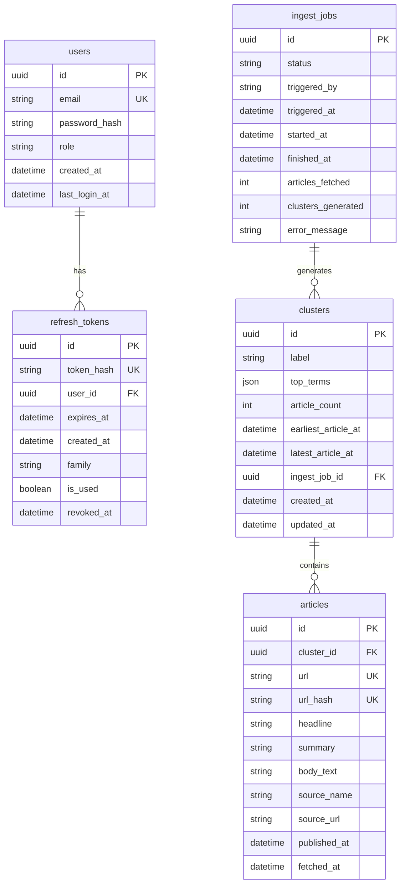

# Database Design — News Pulse

This document describes the database schema for the News Pulse backend.  
All tables are managed via Prisma and PostgreSQL.

---

## Entity Relationship Diagram (Mermaid)

---

## Tables

### users
Stores registered user accounts. Authentication is an optional extension – the core assessment does not require it. We include it only to protect the ingest trigger if desired.

| Column          | Type     | Constraints                       |
|-----------------|----------|-----------------------------------|
| id              | UUID     | PK, default `gen_random_uuid()`   |
| email           | TEXT     | UNIQUE, NOT NULL                  |
| password_hash   | TEXT     | NOT NULL (bcrypt hash)            |
| role            | TEXT     | DEFAULT 'viewer' (admin or viewer)|
| created_at      | TIMESTAMPTZ | DEFAULT now()                   |
| last_login_at   | TIMESTAMPTZ |                                 |

**Indexes:** `email` (lookup on login).

---

### refresh_tokens
Stores hashed refresh tokens for optional JWT rotation. Only used if authentication is enabled.

| Column     | Type     | Constraints                          |
|------------|----------|--------------------------------------|
| id         | UUID     | PK, default `gen_random_uuid()`      |
| token_hash | TEXT     | UNIQUE, NOT NULL (SHA‑256 hex)       |
| user_id    | UUID     | FK → users.id ON DELETE CASCADE      |
| family     | UUID     | NOT NULL                             |
| is_used    | BOOLEAN  | DEFAULT false                        |
| expires_at | TIMESTAMPTZ | NOT NULL (7 days from issue)       |
| created_at | TIMESTAMPTZ | DEFAULT now()                      |
| revoked_at | TIMESTAMPTZ |                                     |

**Indexes:** `token_hash`, `user_id`, `family`, `expires_at`.

---

### ingest_jobs
Tracks each run of the Python scraper + clustering pipeline.

| Column             | Type     | Constraints                                    |
|--------------------|----------|------------------------------------------------|
| id                 | UUID     | PK, default `gen_random_uuid()`                |
| status             | TEXT     | NOT NULL (pending / running / completed / failed) |
| triggered_by       | TEXT     | NOT NULL (api or scheduler)                    |
| triggered_at       | TIMESTAMPTZ | DEFAULT now()                               |
| started_at         | TIMESTAMPTZ |                                               |
| finished_at        | TIMESTAMPTZ |                                               |
| articles_fetched   | INT      |                                               |
| clusters_generated | INT      |                                               |
| error_message      | TEXT     |                                               |

**Indexes:** `status` (worker checks for pending jobs).

---

### clusters
Core grouping entity. Stores the topic label, top TF‑IDF terms, and denormalised time ranges for fast timeline queries.

| Column               | Type     | Constraints                                    |
|----------------------|----------|------------------------------------------------|
| id                   | UUID     | PK, default `gen_random_uuid()`                |
| label                | TEXT     | NOT NULL                                       |
| top_terms            | JSONB    | NOT NULL (array of top terms)                  |
| article_count        | INT      | NOT NULL DEFAULT 0 (denormalised)              |
| earliest_article_at  | TIMESTAMPTZ | (denormalised – min published_at)           |
| latest_article_at    | TIMESTAMPTZ | (denormalised – max published_at)           |
| ingest_job_id        | UUID     | FK → ingest_jobs.id ON DELETE SET NULL         |
| created_at           | TIMESTAMPTZ | DEFAULT now()                               |
| updated_at           | TIMESTAMPTZ | auto‑updated                                |

**Indexes:** `latest_article_at DESC`, `earliest_article_at`, `ingest_job_id`, GIN on `top_terms` (future search).

---

### articles
Stores individual news articles pulled from RSS feeds, with deduplication via URL hash.

| Column        | Type     | Constraints                                    |
|---------------|----------|------------------------------------------------|
| id            | UUID     | PK, default `gen_random_uuid()`                |
| cluster_id    | UUID     | FK → clusters.id ON DELETE SET NULL            |
| url           | TEXT     | UNIQUE, NOT NULL                               |
| url_hash      | TEXT     | UNIQUE, NOT NULL (CHAR(64) SHA‑256)            |
| headline      | TEXT     | NOT NULL                                       |
| summary       | TEXT     |                                                |
| body_text     | TEXT     | (extracted via trafilatura, nullable on fail)  |
| source_name   | TEXT     | NOT NULL (e.g. "BBC News")                     |
| source_url    | TEXT     | NOT NULL (RSS feed URL)                        |
| published_at  | TIMESTAMPTZ | NOT NULL (UTC, normalised from feed)         |
| fetched_at    | TIMESTAMPTZ | DEFAULT now()                                |

**Indexes:** `url_hash` (deduplication), `cluster_id` (JOIN), `published_at DESC` (chronological ordering), `source_name` (filtering).

---

## Relationships

- `users` → `refresh_tokens`: one‑to‑many (if auth is enabled).
- `ingest_jobs` → `clusters`: one‑to‑many (one scraper run produces many clusters).
- `clusters` → `articles`: one‑to‑many (one cluster contains many related articles).
- `articles` → `clusters`: many‑to‑one (an article belongs to at most one cluster; `NULL` means unclustered).

---

## Key Decisions

- **Primary keys are UUIDs** – we use PostgreSQL’s `gen_random_uuid()` for all primary keys. UUIDs are safe to expose in URLs and do not reveal insertion order. The API examples consistently use UUIDs.

- **Denormalisation on clusters** – `article_count`, `earliest_article_at`, and `latest_article_at` are stored directly on the `clusters` row. This avoids expensive `COUNT` and `MIN`/`MAX` aggregations on the `articles` table for every timeline request. These values are updated during each full cluster regeneration.

- **JSONB for `top_terms`** – the cluster’s top TF‑IDF terms are stored as a JSON array. This avoids a separate junction table (which would require a JOIN on every cluster read) and is still queryable via PostgreSQL’s GIN indexes if we later add term‑based search.

- **URL hash for deduplication** – `url_hash` stores a fixed‑length `CHAR(64)` SHA‑256 digest of the article URL. This is indexed for fast duplicate checks. The scraper checks `url_hash` before inserting any new article. **Existing articles are never updated** – if the same URL appears again, it is skipped entirely. This ensures idempotence across runs.

- **Refresh tokens stored as SHA‑256 hash** – the raw refresh token is never persisted. Only its hash is stored, so a database breach does not expose active tokens. Rotation is implemented by marking `is_used = true` and issuing a new token; replay attacks revoke the entire token family.

- **Clusters are fully regenerated each run** – we do not perform incremental updates. On every ingest, all articles are re‑clustered from scratch. Old `clusters` rows are **deleted** and new ones are created. This guarantees coherent clustering without the complexity of merging. The `ingest_job_id` foreign key traces each cluster back to the run that produced it.

- **Hard deletes only** – no `deleted_at` soft‑delete columns are used. This simplifies all queries by removing the need for `WHERE deleted_at IS NULL` checks. If history is needed, the `ingest_jobs` table provides a full audit log of every run.

- **Timestamps are `TIMESTAMPTZ`** – all date/time columns are stored in UTC. The scraper normalises all RSS date formats (RFC‑2822, ISO‑8601, etc.) to UTC before storage, ensuring consistent timeline ordering.

- **No full‑text search in MVP** – search is not a requirement for the initial assessment; if added later, it can be introduced via a `tsvector` column with a GIN index.

- **Authentication tables are optional** – the `users` and `refresh_tokens` tables are only needed if you enable JWT authentication. They are not part of the core assessment and can be omitted or kept without affecting the rest of the schema.
