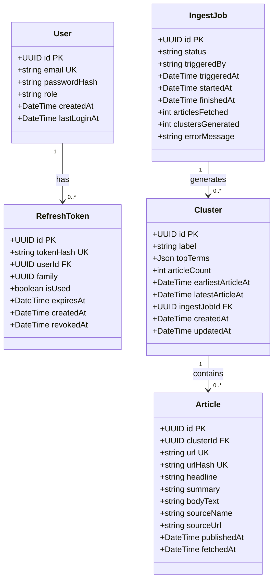

# Domain Model — News Pulse

This document describes the core domain entities, their relationships, state transitions, and invariants. All primary keys are UUIDs.

---

## Overview

The system revolves around a simple workflow:

1. **Articles** are fetched from RSS feeds, normalised, and stored.
2. A **scraper run** (Ingest Job) triggers the TF‑IDF clustering pipeline.
3. **Clusters** group related articles into topics.
4. The **Timeline** visualises these clusters over time.

Authentication is an optional extension – the core assessment does not require it. We include it only to protect the ingest trigger if desired.

---

## Mermaid Class Diagram

---

## Entities

### User (optional)
A person who can log in to the system. Authentication is **not required** by the assessment; we added it as an optional enhancement. If you disable auth, this table and `RefreshToken` can be omitted.

| Field          | Type     | Description |
|----------------|----------|-------------|
| `id`           | UUID     | Primary key, generated by PostgreSQL. |
| `email`        | string   | Unique email address. |
| `passwordHash` | string   | bcrypt hash of the password. |
| `role`         | string   | `admin` or `viewer`. Only `admin` can trigger ingests. |
| `createdAt`    | DateTime | Account creation timestamp. |
| `lastLoginAt`  | DateTime | Last successful login timestamp. |

**Rules:**
- Email must be unique.
- Password is never stored in plain text.
- Only admin users can call `POST /ingest/trigger`.

---

### RefreshToken (optional)
A long‑lived credential issued on login, stored as an `httpOnly` cookie. We never store the raw token value – only its SHA‑256 hash.

| Field          | Type     | Description |
|----------------|----------|-------------|
| `id`           | UUID     | Primary key. |
| `tokenHash`    | string   | SHA‑256 hash of the raw token, unique. |
| `userId`       | UUID     | Foreign key to `users.id`. |
| `family`       | UUID     | Groups tokens from the same login event. |
| `isUsed`       | boolean  | True if this token has already been used to issue a new one. |
| `expiresAt`    | DateTime | When this token expires (7 days after issue). |
| `createdAt`    | DateTime | Token creation timestamp. |
| `revokedAt`    | DateTime | If set, the token is invalid. |

**Rules:**
- A token belongs to exactly one user.
- `tokenHash` is unique – no two tokens share the same hash.
- If a token with `isUsed = true` is presented again, the entire `family` is revoked.

---

### IngestJob
Tracks one complete run of the Python scraper + clustering pipeline.

| Field               | Type     | Description |
|---------------------|----------|-------------|
| `id`                | UUID     | Primary key. |
| `status`            | string   | `pending` / `running` / `completed` / `failed`. |
| `triggeredBy`       | string   | `api` (manual) or `scheduler` (cron). |
| `triggeredAt`       | DateTime | When the job was created. |
| `startedAt`         | DateTime | When the scraper actually started. |
| `finishedAt`        | DateTime | When the scraper exited. |
| `articlesFetched`   | int      | Number of new articles inserted (not duplicates). |
| `clustersGenerated` | int      | Number of clusters produced. |
| `errorMessage`      | string   | If `status = 'failed'`, captures the stderr. |

**Rules:**
- At most one job may be `running` at any time.
- `articlesFetched` and `clustersGenerated` are `null` until the job finishes.
- If `status = 'failed'`, `errorMessage` holds the error details.

---

### Cluster
A group of thematically related articles, generated by TF‑IDF. This is the core unit used for the timeline.

| Field                  | Type     | Description |
|------------------------|----------|-------------|
| `id`                   | UUID     | Primary key. |
| `label`                | string   | Auto‑generated topic label (e.g. "election senate vote"). |
| `topTerms`             | JSONB    | Array of top TF‑IDF terms (3–5). |
| `articleCount`         | int      | Denormalised count of articles in this cluster. |
| `earliestArticleAt`    | DateTime | Denormalised – min `published_at` of articles. |
| `latestArticleAt`      | DateTime | Denormalised – max `published_at` of articles. |
| `ingestJobId`          | UUID     | Foreign key to the job that produced this cluster. |
| `createdAt`            | DateTime | When this cluster was generated. |
| `updatedAt`            | DateTime | Last update timestamp. |

**Rules:**
- A cluster may contain **1 or more** articles (we don't enforce a minimum at the DB level; the frontend can filter by `minArticles`).
- Denormalised fields are recalculated on each full regeneration.
- Clusters are fully regenerated every ingest run – old clusters are deleted, new ones are created.

---

### Article
A single news item, normalised from an RSS feed, with optional body text.

| Field         | Type     | Description |
|---------------|----------|-------------|
| `id`          | UUID     | Primary key. |
| `clusterId`   | UUID     | Foreign key to `clusters.id` (null if unclustered). |
| `url`         | string   | Canonical article URL, unique. |
| `urlHash`     | string   | SHA‑256 of the URL, unique and indexed. |
| `headline`    | string   | Article title. |
| `summary`     | string   | RSS description or content. |
| `bodyText`    | string   | Full article text extracted via trafilatura (null if extraction fails). |
| `sourceName`  | string   | Human‑readable source name (e.g. "BBC News"). |
| `sourceUrl`   | string   | RSS feed URL. |
| `publishedAt` | DateTime | Publication time, normalised to UTC. |
| `fetchedAt`   | DateTime | When this row was created. |

**Rules:**
- `url` and `urlHash` are both unique – deduplication is based on the hash.
- Existing articles are **never updated** – duplicate URLs are skipped entirely.
- `bodyText` may be `null`; this is handled gracefully.

---

## Domain Events (State Transitions)

We do not persist these as event‑sourcing records, but they describe the key state changes in the system.

| Event | Trigger | Effect |
|-------|---------|--------|
| `ArticleFetched` | RSS feed parsed successfully | New `Article` row inserted. |
| `ArticleDeduplicated` | URL hash already exists | Article skipped; no row created. |
| `ArticleBodyExtracted` | trafilatura succeeds | `body_text` populated. |
| `ClusteringCompleted` | TF‑IDF pipeline finishes | Old `Cluster` rows deleted; new ones created; each `Article` gets a `cluster_id`. |
| `IngestJobStarted` | Worker picks a pending job | `status` → `running`; `started_at` set. |
| `IngestJobCompleted` | Python process exits with code 0 | `status` → `completed`; counts set. |
| `IngestJobFailed` | Python process exits non‑zero | `status` → `failed`; `error_message` captured. |
| `TokenRefreshed` (optional) | `/auth/refresh` called | Old refresh token marked `isUsed`; new token issued. |
| `TokenFamilyRevoked` (optional) | Replay attack detected | All tokens in the family are revoked. |

---

## Invariants

Rules that must always hold true for a valid system state:

1. **Unique articles** – No two `Article` rows share the same `url` or `urlHash`.
2. **Single running job** – At most one `IngestJob` with `status = 'running'` at any time.
3. **Denormalised consistency** – For every `Cluster`, `article_count` equals `COUNT(*)` of its articles; `earliest_article_at` and `latest_article_at` match the `MIN`/`MAX` of the articles' `published_at`.
4. **Refresh token integrity** (if auth enabled) – A token with `isUsed = true` is never accepted. Expired tokens (`expires_at < NOW()`) are rejected.
5. **Cluster regeneration** – All clusters are deleted and recreated on each ingest; no incremental updates.
6. **Password security** – `passwordHash` is always a bcrypt hash, never plaintext.

---

## Ubiquitous Language

We use these terms consistently across all documentation and code.

| Term | Definition |
|------|------------|
| **Feed** | External RSS URL we pull articles from. |
| **Article** | A single news item with headline, summary, optional body, and metadata. |
| **Cluster** | A group of ≥1 articles on the same topic, generated by TF‑IDF. |
| **Ingest** | One complete run of the scraper + clustering pipeline. |
| **Ingest Job** | The database record tracking a single ingest run. |
| **Timeline** | The visual UI component that plots clusters as time‑span blocks. |
| **Top Terms** | The 3–5 highest‑weighted TF‑IDF terms that label a cluster. |
| **Similarity Threshold** | The minimum cosine similarity (0.25) to merge articles into a cluster. |
| **Token Family** | (Optional) A group of refresh tokens from one login; used for replay detection. |
| **Deduplication** | Skipping an article that already exists, based on `urlHash`. |
| **Body Extraction** | Using trafilatura to pull the full article text from the article’s web page. |
