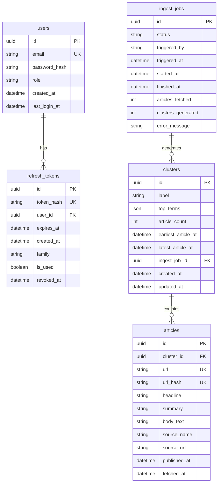
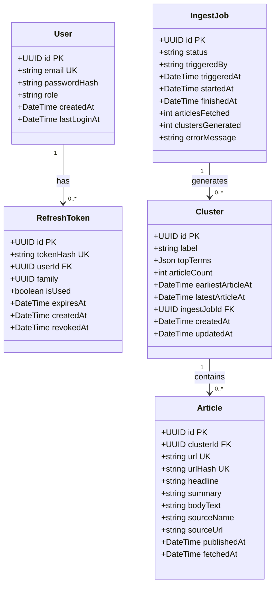
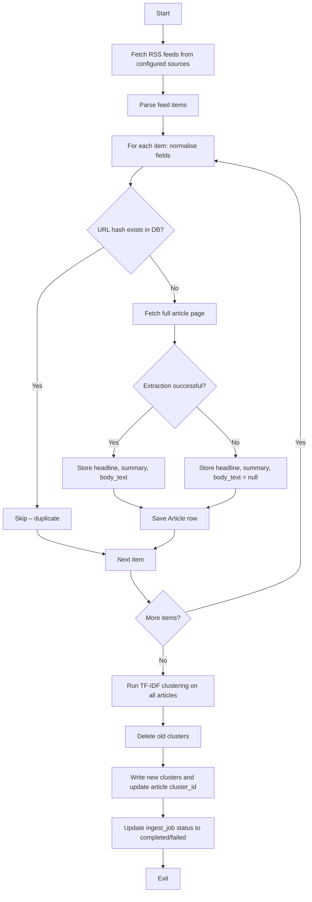

# PROJECT SOURCE CODE

**Project Root:** `/media/user/New Volume/Internship/news-pulse/docs`

---

====================================================================================================
# FILE 1

## Relative Path
`api/api-contract.md`

## Absolute Path
`/media/user/New Volume/Internship/news-pulse/docs/api/api-contract.md`

## Source Code

```md
# API Contract — News Pulse

> **Base URL (production):** `https://news-pulse-backend.onrender.com`  
> **Base URL (local dev):** `http://localhost:3001`  
> **API Version:** v1  
> **Content‑Type:** `application/json` (all requests and responses)  
> **Auth:** JWT Bearer token (access token in `Authorization` header) – *optional; not required by the assessment*  
> **Last Updated:** 2026-06-27

---

## Table of Contents

1. [Overview](#1-overview)  
2. [Global Headers](#2-global-headers)  
3. [Authentication (Optional)](#3-authentication-optional)  
   - 3.1 `POST /auth/login`  
   - 3.2 `POST /auth/refresh`  
   - 3.3 `POST /auth/logout`  
4. [Clusters](#4-clusters)  
   - 4.1 `GET /clusters`  
   - 4.2 `GET /clusters/:id`  
5. [Timeline](#5-timeline)  
   - 5.1 `GET /timeline`  
6. [Ingest Pipeline](#6-ingest-pipeline)  
   - 6.1 `POST /ingest/trigger`  
   - 6.2 `GET /ingest/status/:jobId`  
   - 6.3 `GET /ingest/history`  
7. [Health](#7-health)  
   - 7.1 `GET /health`  
   - 7.2 `GET /health/ready`  
8. [Error Response Format](#8-error-response-format)  
9. [Authentication Flow (Optional)](#9-authentication-flow-optional)  
10. [Ingest Polling Flow](#10-ingest-polling-flow)  
11. [Summary of Error Codes](#11-summary-of-error-codes)

---

## 1. Overview

This API serves the News Pulse system – a topic‑clustered news timeline. The five required endpoints are:

- `GET /clusters` – list clusters  
- `GET /clusters/:id` – cluster detail with articles  
- `GET /timeline` – timeline data for charting  
- `POST /ingest/trigger` – start a scrape + cluster run  
- `GET /ingest/status/:jobId` – poll job progress  

**Authentication:** The original assessment does not require authentication. We have added **JWT‑based authentication** as an optional extension to protect the `POST /ingest/trigger` endpoint from public abuse. If you prefer to skip auth, remove the `security` blocks from the OpenAPI spec and the backend guards – the rest of the API works unchanged. All read endpoints (`/clusters`, `/timeline`) remain public.

**Rate limiting:** We apply rate limits (listed below) to prevent abuse – this is not required but is a common production practice.

---

## 2. Global Headers

| Header | Required | Description |
|--------|----------|-------------|
| `Content-Type` | Yes (on POST/PUT) | Must be `application/json`. |
| `Authorization` | On protected routes | `Bearer <accessToken>`. |
| `X-Request-ID` | Optional | Client‑supplied trace ID; we echo it in the response. |

---

## 3. Authentication (Optional)

These endpoints are only needed if you enable JWT authentication. They are **not required** for the core assessment.

### 3.1 `POST /auth/login`

Authenticate a user with email and password. On success, returns a short‑lived access token in the response body and sets a long‑lived refresh token as an `httpOnly` cookie.

**Auth required:** No

**Request Body:**
```json
{
  "email": "admin@newspulse.com",
  "password": "s3cure-p@ssword"
}
```

| Field | Type | Required | Constraints |
|-------|------|----------|-------------|
| `email` | string | Yes | Valid email format, max 255 chars. |
| `password` | string | Yes | 8–128 chars. |

**Response `200 OK`:**
```json
{
  "accessToken": "eyJhbGciOiJIUzI1NiIsInR5cCI6IkpXVCJ9...",
  "expiresIn": 900,
  "user": {
    "id": "a3f2c1d4-...",
    "email": "admin@newspulse.com",
    "role": "admin"
  }
}
```

**Cookie Set:**
```
Set-Cookie: refreshToken=<token>; HttpOnly; Secure; SameSite=Strict; Path=/auth/refresh; Max-Age=604800
```

**Error Responses:**
| Status | Code | Condition |
|--------|------|-----------|
| `400` | `VALIDATION_ERROR` | Missing or malformed fields. |
| `401` | `INVALID_CREDENTIALS` | Email not found or password incorrect. |
| `429` | `RATE_LIMIT_EXCEEDED` | > 10 login attempts in 15 minutes. |

---

### 3.2 `POST /auth/refresh`

Exchange the `httpOnly` refresh token cookie for a new access token. Rotates the refresh token (old one invalidated, new one issued).

**Auth required:** No (uses `httpOnly` cookie)

**Request Body:** None

**Cookie Required:**
```
Cookie: refreshToken=<token>
```

**Response `200 OK`:**
```json
{
  "accessToken": "eyJhbGciOiJIUzI1NiIsInR5cCI6IkpXVCJ9...",
  "expiresIn": 900
}
```

**Cookie Set:** Replaces the old refresh token with a new one.

**Error Responses:**
| Status | Code | Condition |
|--------|------|-----------|
| `401` | `REFRESH_TOKEN_MISSING` | No cookie present. |
| `401` | `REFRESH_TOKEN_INVALID` | Token is expired, malformed, or not in our DB. |
| `401` | `REFRESH_TOKEN_REUSED` | Token was already used (replay attack) – revokes the entire family. |
| `429` | `RATE_LIMIT_EXCEEDED` | > 20 refresh attempts in 1 minute. |

---

### 3.3 `POST /auth/logout`

Invalidate the current refresh token and clear the cookie. The access token expires naturally after 15 minutes.

**Auth required:** Yes (access token)

**Request Body:** None

**Response `200 OK`:**
```json
{
  "message": "Logged out successfully"
}
```

**Cookie Cleared:**
```
Set-Cookie: refreshToken=; HttpOnly; Secure; SameSite=Strict; Path=/auth/refresh; Max-Age=0
```

**Error Responses:**
| Status | Code | Condition |
|--------|------|-----------|
| `401` | `UNAUTHORIZED` | Missing or invalid access token. |

---

## 4. Clusters

### 4.1 `GET /clusters`

Return a paginated list of all topic clusters, ordered by most recent activity (latest article first).

**Auth required:** No

**Query Parameters:**
| Param | Type | Default | Description |
|-------|------|---------|-------------|
| `page` | integer | 1 | Page number (1‑indexed). |
| `limit` | integer | 20 | Items per page (max 100). |
| `source` | string | — | Filter by source name. Multiple sources can be specified by repeating the parameter: `?source=BBC+News&source=NPR`. The backend treats this as an OR filter – articles from any of the listed sources are included. |
| `from` | ISO‑8601 | — | Return clusters with `latest_article_at` after this datetime. |
| `to` | ISO‑8601 | — | Return clusters with `earliest_article_at` before this datetime. |

**Response `200 OK`:**
```json
{
  "data": [
    {
      "id": "b4e2a1c3-9f8d-4b2a-a1c3-9f8d4b2aa1c3",
      "label": "election senate vote bill",
      "topTerms": ["election", "senate", "vote", "bill", "congress"],
      "articleCount": 7,
      "earliestArticleAt": "2026-06-26T08:14:00Z",
      "latestArticleAt": "2026-06-27T11:47:00Z",
      "sources": ["BBC News", "NPR", "The Guardian"],
      "createdAt": "2026-06-26T09:00:00Z"
    }
  ],
  "meta": {
    "page": 1,
    "limit": 20,
    "total": 43,
    "totalPages": 3
  }
}
```

**Response Fields – Cluster Object:**
| Field | Type | Description |
|-------|------|-------------|
| `id` | UUID string | Cluster identifier. |
| `label` | string | Auto‑generated topic label. |
| `topTerms` | string[] | Top TF‑IDF terms (max 5). |
| `articleCount` | integer | Number of articles in this cluster. |
| `earliestArticleAt` | ISO‑8601 | Publication time of the oldest article. |
| `latestArticleAt` | ISO‑8601 | Publication time of the newest article. |
| `sources` | string[] | Distinct news sources contributing to this cluster. |
| `createdAt` | ISO‑8601 | When this cluster was generated. |

**Error Responses:**
| Status | Code | Condition |
|--------|------|-----------|
| `400` | `VALIDATION_ERROR` | `page` < 1, `limit` > 100, invalid date format. |
| `429` | `RATE_LIMIT_EXCEEDED` | Global rate limit hit. |

---

### 4.2 `GET /clusters/:id`

Return full detail for a single cluster, including all its articles sorted chronologically (oldest first).

**Auth required:** No

**Path Parameters:**
| Param | Type | Description |
|-------|------|-------------|
| `id` | UUID | Cluster ID. |

**Query Parameters:**
| Param | Type | Default | Description |
|-------|------|---------|-------------|
| `source` | string | — | Filter articles within the cluster by source (repeat allowed). |

**Response `200 OK`:**
```json
{
  "id": "b4e2a1c3-9f8d-4b2a-a1c3-9f8d4b2aa1c3",
  "label": "election senate vote bill",
  "topTerms": ["election", "senate", "vote", "bill", "congress"],
  "articleCount": 7,
  "earliestArticleAt": "2026-06-26T08:14:00Z",
  "latestArticleAt": "2026-06-27T11:47:00Z",
  "createdAt": "2026-06-26T09:00:00Z",
  "articles": [
    {
      "id": "c5d3b2a1-...",
      "headline": "Senate passes sweeping election bill after marathon debate",
      "summary": "The Senate voted 52-48 early Friday to pass...",
      "sourceName": "BBC News",
      "sourceUrl": "https://feeds.bbci.co.uk/news/rss.xml",
      "publishedAt": "2026-06-26T08:14:00Z",
      "url": "https://www.bbc.co.uk/news/world-us-canada-..."
    }
  ]
}
```

**Error Responses:**
| Status | Code | Condition |
|--------|------|-----------|
| `400` | `VALIDATION_ERROR` | `id` is not a valid UUID. |
| `404` | `CLUSTER_NOT_FOUND` | No cluster with this ID. |

---

## 5. Timeline

### 5.1 `GET /timeline`

Return cluster data formatted specifically for timeline visualisation. Each cluster becomes a time‑span block with `start`, `end`, and `intensity` – ready for charting libraries like recharts or vis‑timeline.

**Auth required:** No

**Query Parameters:**
| Param | Type | Default | Description |
|-------|------|---------|-------------|
| `from` | ISO‑8601 | 7 days ago | Timeline start boundary. |
| `to` | ISO‑8601 | now | Timeline end boundary. |
| `source` | string | — | Filter by source name (repeat allowed). |
| `minArticles` | integer | 1 | Only include clusters with ≥ this many articles. |

**Response `200 OK`:**
```json
{
  "timeRange": {
    "from": "2026-06-20T00:00:00Z",
    "to": "2026-06-27T23:59:59Z"
  },
  "sources": ["BBC News", "NPR", "The Guardian"],
  "clusters": [
    {
      "id": "b4e2a1c3-...",
      "label": "election senate vote bill",
      "topTerms": ["election", "senate", "vote", "bill"],
      "start": "2026-06-26T08:14:00Z",
      "end": "2026-06-27T11:47:00Z",
      "articleCount": 7,
      "intensity": 0.78,
      "sources": ["BBC News", "NPR"]
    }
  ],
  "meta": {
    "totalClusters": 23,
    "totalArticles": 147,
    "lastIngestAt": "2026-06-27T11:00:00Z"
  }
}
```

**Response Fields – Cluster Object:**
| Field | Type | Description |
|-------|------|-------------|
| `id` | UUID string | Cluster ID. |
| `label` | string | Topic label. |
| `topTerms` | string[] | Top TF‑IDF terms. |
| `start` | ISO‑8601 | Earliest article `published_at` in this cluster. |
| `end` | ISO‑8601 | Latest article `published_at` in this cluster. |
| `articleCount` | integer | Number of articles. |
| `intensity` | float 0.0–1.0 | Normalised article count relative to the largest cluster in the result set. We pre‑compute this so the frontend can size markers directly. |
| `sources` | string[] | Distinct source names. |

**Error Responses:**
| Status | Code | Condition |
|--------|------|-----------|
| `400` | `VALIDATION_ERROR` | `from` > `to`, invalid date format, `minArticles` < 1. |

---

## 6. Ingest Pipeline

### 6.1 `POST /ingest/trigger`

Trigger a new scrape + cluster run. We create an ingest job and return its ID immediately. The job runs asynchronously.

**Auth required:** Yes (access token, `admin` role required – *this is an optional security enhancement; remove the guard if not needed*)

**Request Body:** None

**Response `202 Accepted`:**
```json
{
  "jobId": "d6e4c3b2-...",
  "status": "pending",
  "message": "Ingest job created. Poll /ingest/status/:jobId for updates.",
  "triggeredAt": "2026-06-27T12:00:00Z"
}
```

**Error Responses:**
| Status | Code | Condition |
|--------|------|-----------|
| `401` | `UNAUTHORIZED` | Missing or invalid access token. |
| `403` | `FORBIDDEN` | Valid token but user is not `admin` role. |
| `409` | `JOB_ALREADY_RUNNING` | An ingest job is already in `running` state. |
| `429` | `RATE_LIMIT_EXCEEDED` | > 5 trigger calls in 1 minute. |

---

### 6.2 `GET /ingest/status/:jobId`

Poll the status of an ingest job.

**Auth required:** Yes (access token – optional)

**Path Parameters:**
| Param | Type | Description |
|-------|------|-------------|
| `jobId` | UUID | Job ID from the trigger response. |

**Response `200 OK` (pending):**
```json
{
  "jobId": "d6e4c3b2-...",
  "status": "pending",
  "triggeredBy": "api",
  "triggeredAt": "2026-06-27T12:00:00Z",
  "startedAt": null,
  "finishedAt": null,
  "articlesFetched": null,
  "clustersGenerated": null,
  "errorMessage": null
}
```

**Response `200 OK` (running):**
```json
{
  "jobId": "d6e4c3b2-...",
  "status": "running",
  "triggeredBy": "api",
  "triggeredAt": "2026-06-27T12:00:00Z",
  "startedAt": "2026-06-27T12:00:02Z",
  "finishedAt": null,
  "articlesFetched": null,
  "clustersGenerated": null,
  "errorMessage": null
}
```

**Response `200 OK` (completed):**
```json
{
  "jobId": "d6e4c3b2-...",
  "status": "completed",
  "triggeredBy": "api",
  "triggeredAt": "2026-06-27T12:00:00Z",
  "startedAt": "2026-06-27T12:00:02Z",
  "finishedAt": "2026-06-27T12:00:47Z",
  "articlesFetched": 34,
  "clustersGenerated": 11,
  "errorMessage": null
}
```

**Response `200 OK` (failed):**
```json
{
  "jobId": "d6e4c3b2-...",
  "status": "failed",
  "triggeredBy": "api",
  "triggeredAt": "2026-06-27T12:00:00Z",
  "startedAt": "2026-06-27T12:00:02Z",
  "finishedAt": "2026-06-27T12:00:09Z",
  "articlesFetched": null,
  "clustersGenerated": null,
  "errorMessage": "Feed fetch failed: HTTPSConnectionPool(host='feeds.bbci.co.uk'): Read timed out."
}
```

**Error Responses:**
| Status | Code | Condition |
|--------|------|-----------|
| `400` | `VALIDATION_ERROR` | `jobId` is not a valid UUID. |
| `401` | `UNAUTHORIZED` | Missing or invalid access token. |
| `404` | `JOB_NOT_FOUND` | No job with this ID. |

---

### 6.3 `GET /ingest/history`

Return a list of recent ingest jobs. Useful for an admin dashboard.

**Auth required:** Yes (access token – optional)

**Query Parameters:**
| Param | Type | Default | Description |
|-------|------|---------|-------------|
| `page` | integer | 1 | Page number. |
| `limit` | integer | 10 | Items per page (max 50). |

**Response `200 OK`:**
```json
{
  "data": [
    {
      "jobId": "d6e4c3b2-...",
      "status": "completed",
      "triggeredBy": "scheduler",
      "triggeredAt": "2026-06-27T11:00:00Z",
      "finishedAt": "2026-06-27T11:00:52Z",
      "articlesFetched": 28,
      "clustersGenerated": 9
    }
  ],
  "meta": {
    "page": 1,
    "limit": 10,
    "total": 24
  }
}
```

---

## 7. Health

### 7.1 `GET /health`

Lightweight liveness check. Returns 200 if the API is running.

**Auth required:** No

**Response `200 OK`:**
```json
{
  "status": "ok",
  "timestamp": "2026-06-27T12:00:00Z",
  "version": "1.0.0"
}
```

---

### 7.2 `GET /health/ready`

Readiness check – confirms API + database connectivity.

**Auth required:** No

**Response `200 OK`:**
```json
{
  "status": "ready",
  "checks": {
    "database": "ok",
    "timestamp": "2026-06-27T12:00:00Z"
  }
}
```

**Response `503 Service Unavailable`:**
```json
{
  "status": "not_ready",
  "checks": {
    "database": "error: connection refused"
  }
}
```

---

## 8. Error Response Format

We use a single envelope for all error responses:

```json
{
  "error": {
    "code": "CLUSTER_NOT_FOUND",
    "message": "No cluster found with id b4e2a1c3-9f8d-4b2a-a1c3-9f8d4b2aa1c3",
    "statusCode": 404,
    "requestId": "req-abc123"
  }
}
```

| Field | Type | Description |
|-------|------|-------------|
| `code` | string | Machine‑readable error constant (SCREAMING_SNAKE_CASE). |
| `message` | string | Human‑readable description. Safe to show in UI. |
| `statusCode` | integer | Mirrors the HTTP status code. |
| `requestId` | string | Trace ID for log correlation (echoed from `X-Request-ID` or server‑generated). |

**Validation errors** include a `details` array:

```json
{
  "error": {
    "code": "VALIDATION_ERROR",
    "message": "Request validation failed",
    "statusCode": 400,
    "requestId": "req-abc123",
    "details": [
      {
        "field": "email",
        "message": "must be a valid email address"
      },
      {
        "field": "password",
        "message": "must be at least 8 characters"
      }
    ]
  }
}
```

---

## 9. Authentication Flow (Optional)

If JWT authentication is enabled, the flow is:

1. **Login** – Client sends `POST /auth/login` with email/password.
2. The API verifies credentials, creates a refresh token record (SHA‑256 hashed), and returns an access token + sets an `httpOnly` cookie.
3. For protected requests, the client sends `Authorization: Bearer <accessToken>`.
4. When the access token expires (15 min), the client calls `POST /auth/refresh` with the cookie.
5. The API validates the refresh token (not used, not expired), marks it used, issues a new token pair, and returns a new access token.
6. If a used token is presented, the entire token family is revoked.
7. Logout invalidates the refresh token and clears the cookie.

---

## 10. Ingest Polling Flow

1. Frontend calls `POST /ingest/trigger` with a valid access token (if auth enabled).
2. API creates an `ingest_jobs` row with `status = 'pending'` and returns `jobId` (202 Accepted).
3. A background worker in the API (`setInterval`) polls for pending jobs.
4. When a pending job is found, the worker updates status to `'running'`, records `started_at`, and spawns the Python scraper via `child_process.spawn`.
5. Frontend polls `GET /ingest/status/:jobId` every 3 seconds.
6. On scraper exit, the worker updates the job with `finished_at`, counts, or `error_message`, and sets `status` to `'completed'` or `'failed'`.
7. Frontend stops polling on final status and refreshes the timeline.

---

## 11. Summary of Error Codes

| Error Code | HTTP Status | Description |
|------------|-------------|-------------|
| `VALIDATION_ERROR` | 400 | Request body or query parameters failed validation. |
| `INVALID_CREDENTIALS` | 401 | Email or password is incorrect. |
| `REFRESH_TOKEN_MISSING` | 401 | No refresh token cookie was sent. |
| `REFRESH_TOKEN_INVALID` | 401 | Refresh token is expired, malformed, or absent from DB. |
| `REFRESH_TOKEN_REUSED` | 401 | Refresh token was already used; family revoked. |
| `UNAUTHORIZED` | 401 | Access token missing, expired, or invalid. |
| `FORBIDDEN` | 403 | Valid access token but insufficient role (e.g. not admin). |
| `CLUSTER_NOT_FOUND` | 404 | No cluster matches the requested ID. |
| `JOB_NOT_FOUND` | 404 | No ingest job matches the requested ID. |
| `JOB_ALREADY_RUNNING` | 409 | A job is already in `running` state; cannot start another. |
| `RATE_LIMIT_EXCEEDED` | 429 | Too many requests; retry after the `Retry-After` header. |
| `INTERNAL_SERVER_ERROR` | 500 | Unexpected server error (should not happen in normal operation). |
```

====================================================================================================
# FILE 2

## Relative Path
`api/openapi-spec.json`

## Absolute Path
`/media/user/New Volume/Internship/news-pulse/docs/api/openapi-spec.json`

## Source Code

```json
{
  "openapi": "3.1.0",
  "info": {
    "title": "News Pulse API",
    "description": "REST API for News Pulse – a topic-clustered news timeline system.\n\nPulls articles from RSS feeds, groups them into topic clusters using TF-IDF,\nand serves the results for timeline visualization.\n\nAuthentication is optional – the assessment does not require it. We added JWT Bearer\ntokens to protect the ingest endpoint from public abuse. If you skip auth, remove\nthe security requirements from the spec and the backend guards.\n\nRate limiting is also applied to prevent abuse.",
    "version": "1.0.0",
    "contact": {
      "name": "News Pulse",
      "email": "admin@newspulse.com"
    }
  },
  "servers": [
    {
      "url": "https://news-pulse-backend.onrender.com",
      "description": "Production (Render)"
    },
    {
      "url": "http://localhost:3001",
      "description": "Local development"
    }
  ],
  "tags": [
    { "name": "auth", "description": "Authentication (optional) – login, token refresh, logout" },
    { "name": "clusters", "description": "Topic cluster read endpoints" },
    { "name": "timeline", "description": "Timeline visualization data" },
    { "name": "ingest", "description": "Scraper pipeline control and status" },
    { "name": "health", "description": "API liveness and readiness checks" }
  ],
  "components": {
    "securitySchemes": {
      "BearerAuth": {
        "type": "http",
        "scheme": "bearer",
        "bearerFormat": "JWT",
        "description": "Optional access token obtained from POST /auth/login or POST /auth/refresh. TTL: 15 minutes. Not required for the core assessment."
      }
    },
    "schemas": {
      "ErrorResponse": {
        "type": "object",
        "required": ["error"],
        "properties": {
          "error": {
            "type": "object",
            "required": ["code", "message", "statusCode"],
            "properties": {
              "code": {
                "type": "string",
                "example": "CLUSTER_NOT_FOUND",
                "description": "Machine-readable error constant (SCREAMING_SNAKE_CASE)"
              },
              "message": {
                "type": "string",
                "example": "No cluster found with id b4e2a1c3-...",
                "description": "Human-readable error description, safe to display in UI"
              },
              "statusCode": {
                "type": "integer",
                "example": 404
              },
              "requestId": {
                "type": "string",
                "example": "req-abc123"
              },
              "details": {
                "type": "array",
                "description": "Present only on VALIDATION_ERROR",
                "items": {
                  "type": "object",
                  "properties": {
                    "field": { "type": "string", "example": "email" },
                    "message": { "type": "string", "example": "must be a valid email address" }
                  }
                }
              }
            }
          }
        }
      },
      "PaginationMeta": {
        "type": "object",
        "required": ["page", "limit", "total", "totalPages"],
        "properties": {
          "page": { "type": "integer", "example": 1 },
          "limit": { "type": "integer", "example": 20 },
          "total": { "type": "integer", "example": 43 },
          "totalPages": { "type": "integer", "example": 3 }
        }
      },
      "LoginRequest": {
        "type": "object",
        "required": ["email", "password"],
        "properties": {
          "email": { "type": "string", "format": "email", "example": "admin@newspulse.com" },
          "password": { "type": "string", "minLength": 8, "maxLength": 128, "example": "s3cure-p@ssword" }
        }
      },
      "LoginResponse": {
        "type": "object",
        "required": ["accessToken", "expiresIn", "user"],
        "properties": {
          "accessToken": { "type": "string", "example": "eyJhbGciOiJIUzI1NiIsInR5cCI6IkpXVCJ9..." },
          "expiresIn": { "type": "integer", "example": 900 },
          "user": {
            "type": "object",
            "required": ["id", "email", "role"],
            "properties": {
              "id": { "type": "string", "format": "uuid", "example": "a3f2c1d4-9f8d-4b2a-a1c3-9f8d4b2aa1c3" },
              "email": { "type": "string", "example": "admin@newspulse.com" },
              "role": { "type": "string", "enum": ["admin", "viewer"], "example": "admin" }
            }
          }
        }
      },
      "RefreshResponse": {
        "type": "object",
        "required": ["accessToken", "expiresIn"],
        "properties": {
          "accessToken": { "type": "string", "example": "eyJhbGciOiJIUzI1NiIsInR5cCI6IkpXVCJ9..." },
          "expiresIn": { "type": "integer", "example": 900 }
        }
      },
      "Article": {
        "type": "object",
        "required": ["id", "headline", "sourceName", "sourceUrl", "publishedAt", "url"],
        "properties": {
          "id": { "type": "string", "format": "uuid", "example": "c5d3b2a1-1234-4b2a-a1c3-9f8d4b2aa1c3" },
          "headline": { "type": "string", "example": "Senate passes sweeping election bill after marathon debate" },
          "summary": { "type": "string", "nullable": true, "example": "The Senate voted 52-48 early Friday to pass..." },
          "sourceName": { "type": "string", "example": "BBC News" },
          "sourceUrl": { "type": "string", "format": "uri", "example": "https://feeds.bbci.co.uk/news/rss.xml" },
          "publishedAt": { "type": "string", "format": "date-time", "example": "2026-06-26T08:14:00Z" },
          "url": { "type": "string", "format": "uri", "example": "https://www.bbc.co.uk/news/world-us-canada-12345678" }
        }
      },
      "ClusterSummary": {
        "type": "object",
        "required": ["id", "label", "topTerms", "articleCount", "earliestArticleAt", "latestArticleAt", "sources", "createdAt"],
        "properties": {
          "id": { "type": "string", "format": "uuid", "example": "b4e2a1c3-9f8d-4b2a-a1c3-9f8d4b2aa1c3" },
          "label": { "type": "string", "example": "election senate vote bill" },
          "topTerms": { "type": "array", "items": { "type": "string" }, "example": ["election", "senate", "vote", "bill", "congress"] },
          "articleCount": { "type": "integer", "minimum": 1, "example": 7 },
          "earliestArticleAt": { "type": "string", "format": "date-time", "example": "2026-06-26T08:14:00Z" },
          "latestArticleAt": { "type": "string", "format": "date-time", "example": "2026-06-27T11:47:00Z" },
          "sources": { "type": "array", "items": { "type": "string" }, "example": ["BBC News", "NPR", "The Guardian"] },
          "createdAt": { "type": "string", "format": "date-time", "example": "2026-06-26T09:00:00Z" }
        }
      },
      "ClusterDetail": {
        "allOf": [
          { "$ref": "#/components/schemas/ClusterSummary" },
          {
            "type": "object",
            "required": ["articles"],
            "properties": {
              "articles": {
                "type": "array",
                "items": { "$ref": "#/components/schemas/Article" }
              }
            }
          }
        ]
      },
      "TimelineCluster": {
        "type": "object",
        "required": ["id", "label", "topTerms", "start", "end", "articleCount", "intensity", "sources"],
        "properties": {
          "id": { "type": "string", "format": "uuid", "example": "b4e2a1c3-9f8d-4b2a-a1c3-9f8d4b2aa1c3" },
          "label": { "type": "string", "example": "election senate vote bill" },
          "topTerms": { "type": "array", "items": { "type": "string" }, "example": ["election", "senate", "vote", "bill"] },
          "start": { "type": "string", "format": "date-time", "example": "2026-06-26T08:14:00Z" },
          "end": { "type": "string", "format": "date-time", "example": "2026-06-27T11:47:00Z" },
          "articleCount": { "type": "integer", "example": 7 },
          "intensity": { "type": "number", "format": "float", "minimum": 0, "maximum": 1, "example": 0.78 },
          "sources": { "type": "array", "items": { "type": "string" }, "example": ["BBC News", "NPR"] }
        }
      },
      "TimelineResponse": {
        "type": "object",
        "required": ["timeRange", "sources", "clusters", "meta"],
        "properties": {
          "timeRange": {
            "type": "object",
            "required": ["from", "to"],
            "properties": {
              "from": { "type": "string", "format": "date-time", "example": "2026-06-20T00:00:00Z" },
              "to": { "type": "string", "format": "date-time", "example": "2026-06-27T23:59:59Z" }
            }
          },
          "sources": { "type": "array", "items": { "type": "string" }, "example": ["BBC News", "NPR", "The Guardian"] },
          "clusters": { "type": "array", "items": { "$ref": "#/components/schemas/TimelineCluster" } },
          "meta": {
            "type": "object",
            "required": ["totalClusters", "totalArticles", "lastIngestAt"],
            "properties": {
              "totalClusters": { "type": "integer", "example": 23 },
              "totalArticles": { "type": "integer", "example": 147 },
              "lastIngestAt": { "type": "string", "format": "date-time", "nullable": true, "example": "2026-06-27T11:00:00Z" }
            }
          }
        }
      },
      "IngestJobStatus": {
        "type": "object",
        "required": ["jobId", "status", "triggeredBy", "triggeredAt"],
        "properties": {
          "jobId": { "type": "string", "format": "uuid", "example": "d6e4c3b2-9f8d-4b2a-a1c3-9f8d4b2aa1c3" },
          "status": { "type": "string", "enum": ["pending", "running", "completed", "failed"], "example": "completed" },
          "triggeredBy": { "type": "string", "enum": ["api", "scheduler"], "example": "api" },
          "triggeredAt": { "type": "string", "format": "date-time", "example": "2026-06-27T12:00:00Z" },
          "startedAt": { "type": "string", "format": "date-time", "nullable": true, "example": "2026-06-27T12:00:02Z" },
          "finishedAt": { "type": "string", "format": "date-time", "nullable": true, "example": "2026-06-27T12:00:47Z" },
          "articlesFetched": { "type": "integer", "nullable": true, "example": 34 },
          "clustersGenerated": { "type": "integer", "nullable": true, "example": 11 },
          "errorMessage": { "type": "string", "nullable": true, "example": null }
        }
      },
      "TriggerResponse": {
        "type": "object",
        "required": ["jobId", "status", "message", "triggeredAt"],
        "properties": {
          "jobId": { "type": "string", "format": "uuid", "example": "d6e4c3b2-9f8d-4b2a-a1c3-9f8d4b2aa1c3" },
          "status": { "type": "string", "enum": ["pending"], "example": "pending" },
          "message": { "type": "string", "example": "Ingest job created. Poll /ingest/status/:jobId for updates." },
          "triggeredAt": { "type": "string", "format": "date-time", "example": "2026-06-27T12:00:00Z" }
        }
      }
    },
    "responses": {
      "Unauthorized": {
        "description": "Missing or invalid access token (only if auth enabled)",
        "content": {
          "application/json": {
            "schema": { "$ref": "#/components/schemas/ErrorResponse" },
            "example": {
              "error": {
                "code": "UNAUTHORIZED",
                "message": "Authorization token is missing or invalid",
                "statusCode": 401
              }
            }
          }
        }
      },
      "Forbidden": {
        "description": "Valid token but insufficient role (only if auth enabled)",
        "content": {
          "application/json": {
            "schema": { "$ref": "#/components/schemas/ErrorResponse" },
            "example": {
              "error": {
                "code": "FORBIDDEN",
                "message": "Admin role required for this action",
                "statusCode": 403
              }
            }
          }
        }
      },
      "NotFound": {
        "description": "Resource not found",
        "content": {
          "application/json": {
            "schema": { "$ref": "#/components/schemas/ErrorResponse" }
          }
        }
      },
      "ValidationError": {
        "description": "Request failed schema validation",
        "content": {
          "application/json": {
            "schema": { "$ref": "#/components/schemas/ErrorResponse" },
            "example": {
              "error": {
                "code": "VALIDATION_ERROR",
                "message": "Request validation failed",
                "statusCode": 400,
                "details": [
                  { "field": "email", "message": "must be a valid email address" }
                ]
              }
            }
          }
        }
      },
      "RateLimited": {
        "description": "Rate limit exceeded",
        "headers": {
          "Retry-After": {
            "schema": { "type": "integer" },
            "description": "Seconds to wait before retrying"
          }
        },
        "content": {
          "application/json": {
            "schema": { "$ref": "#/components/schemas/ErrorResponse" },
            "example": {
              "error": {
                "code": "RATE_LIMIT_EXCEEDED",
                "message": "Too many requests. Retry after 47 seconds.",
                "statusCode": 429
              }
            }
          }
        }
      }
    },
    "parameters": {
      "PageParam": {
        "name": "page",
        "in": "query",
        "schema": { "type": "integer", "minimum": 1, "default": 1 },
        "description": "Page number (1-indexed)"
      },
      "LimitParam": {
        "name": "limit",
        "in": "query",
        "schema": { "type": "integer", "minimum": 1, "maximum": 100, "default": 20 },
        "description": "Items per page"
      },
      "SourceFilterParam": {
        "name": "source",
        "in": "query",
        "schema": {
          "type": "array",
          "items": { "type": "string" }
        },
        "style": "form",
        "explode": true,
        "description": "Filter by source name. Repeat the parameter for multiple sources (OR filter). Example: ?source=BBC+News&source=NPR"
      }
    }
  },
  "paths": {
    "/auth/login": {
      "post": {
        "tags": ["auth"],
        "summary": "Log in and obtain tokens (optional)",
        "description": "Authenticate with email/password. Returns access token and sets httpOnly refresh cookie. Only needed if you enable JWT authentication.",
        "operationId": "login",
        "requestBody": {
          "required": true,
          "content": {
            "application/json": {
              "schema": { "$ref": "#/components/schemas/LoginRequest" }
            }
          }
        },
        "responses": {
          "200": {
            "description": "Login successful",
            "headers": {
              "Set-Cookie": {
                "schema": {
                  "type": "string",
                  "example": "refreshToken=<token>; HttpOnly; Secure; SameSite=Strict; Path=/auth/refresh; Max-Age=604800"
                }
              }
            },
            "content": {
              "application/json": {
                "schema": { "$ref": "#/components/schemas/LoginResponse" }
              }
            }
          },
          "400": { "$ref": "#/components/responses/ValidationError" },
          "401": {
            "description": "Invalid credentials",
            "content": {
              "application/json": {
                "schema": { "$ref": "#/components/schemas/ErrorResponse" },
                "example": {
                  "error": {
                    "code": "INVALID_CREDENTIALS",
                    "message": "Email or password is incorrect",
                    "statusCode": 401
                  }
                }
              }
            }
          },
          "429": { "$ref": "#/components/responses/RateLimited" }
        }
      }
    },
    "/auth/refresh": {
      "post": {
        "tags": ["auth"],
        "summary": "Refresh access token (optional)",
        "description": "Use httpOnly refresh token cookie to get a new access token. Rotates the refresh token.",
        "operationId": "refreshToken",
        "parameters": [
          {
            "in": "cookie",
            "name": "refreshToken",
            "required": true,
            "schema": { "type": "string" }
          }
        ],
        "responses": {
          "200": {
            "description": "New access token issued",
            "headers": {
              "Set-Cookie": {
                "schema": {
                  "type": "string",
                  "example": "refreshToken=<new_token>; HttpOnly; Secure; SameSite=Strict; Path=/auth/refresh; Max-Age=604800"
                }
              }
            },
            "content": {
              "application/json": {
                "schema": { "$ref": "#/components/schemas/RefreshResponse" }
              }
            }
          },
          "401": {
            "description": "Refresh token missing, invalid, expired, or replayed",
            "content": {
              "application/json": {
                "schema": { "$ref": "#/components/schemas/ErrorResponse" },
                "examples": {
                  "missing": {
                    "value": {
                      "error": {
                        "code": "REFRESH_TOKEN_MISSING",
                        "message": "No refresh token cookie found",
                        "statusCode": 401
                      }
                    }
                  },
                  "reused": {
                    "value": {
                      "error": {
                        "code": "REFRESH_TOKEN_REUSED",
                        "message": "Token reuse detected. All sessions have been invalidated.",
                        "statusCode": 401
                      }
                    }
                  }
                }
              }
            }
          },
          "429": { "$ref": "#/components/responses/RateLimited" }
        }
      }
    },
    "/auth/logout": {
      "post": {
        "tags": ["auth"],
        "summary": "Log out (optional)",
        "description": "Invalidates refresh token and clears cookie. Requires access token.",
        "operationId": "logout",
        "security": [{ "BearerAuth": [] }],
        "responses": {
          "200": {
            "description": "Logged out successfully",
            "headers": {
              "Set-Cookie": {
                "schema": {
                  "type": "string",
                  "example": "refreshToken=; HttpOnly; Secure; SameSite=Strict; Path=/auth/refresh; Max-Age=0"
                }
              }
            },
            "content": {
              "application/json": {
                "schema": {
                  "type": "object",
                  "properties": {
                    "message": { "type": "string", "example": "Logged out successfully" }
                  }
                }
              }
            }
          },
          "401": { "$ref": "#/components/responses/Unauthorized" }
        }
      }
    },
    "/clusters": {
      "get": {
        "tags": ["clusters"],
        "summary": "List topic clusters",
        "description": "Returns paginated list of clusters ordered by most recent activity. Supports source filtering (multiple allowed) and date range.",
        "operationId": "listClusters",
        "parameters": [
          { "$ref": "#/components/parameters/PageParam" },
          { "$ref": "#/components/parameters/LimitParam" },
          { "$ref": "#/components/parameters/SourceFilterParam" },
          {
            "name": "from",
            "in": "query",
            "schema": { "type": "string", "format": "date-time" },
            "description": "Return clusters with latest_article_at after this datetime"
          },
          {
            "name": "to",
            "in": "query",
            "schema": { "type": "string", "format": "date-time" },
            "description": "Return clusters with earliest_article_at before this datetime"
          }
        ],
        "responses": {
          "200": {
            "description": "Cluster list",
            "content": {
              "application/json": {
                "schema": {
                  "type": "object",
                  "required": ["data", "meta"],
                  "properties": {
                    "data": {
                      "type": "array",
                      "items": { "$ref": "#/components/schemas/ClusterSummary" }
                    },
                    "meta": { "$ref": "#/components/schemas/PaginationMeta" }
                  }
                }
              }
            }
          },
          "400": { "$ref": "#/components/responses/ValidationError" },
          "429": { "$ref": "#/components/responses/RateLimited" }
        }
      }
    },
    "/clusters/{id}": {
      "get": {
        "tags": ["clusters"],
        "summary": "Get cluster detail",
        "description": "Returns full cluster detail with articles sorted chronologically.",
        "operationId": "getCluster",
        "parameters": [
          {
            "name": "id",
            "in": "path",
            "required": true,
            "schema": { "type": "string", "format": "uuid" },
            "description": "Cluster UUID"
          },
          { "$ref": "#/components/parameters/SourceFilterParam" }
        ],
        "responses": {
          "200": {
            "description": "Cluster detail with articles",
            "content": {
              "application/json": {
                "schema": { "$ref": "#/components/schemas/ClusterDetail" }
              }
            }
          },
          "400": { "$ref": "#/components/responses/ValidationError" },
          "404": { "$ref": "#/components/responses/NotFound" },
          "429": { "$ref": "#/components/responses/RateLimited" }
        }
      }
    },
    "/timeline": {
      "get": {
        "tags": ["timeline"],
        "summary": "Get timeline visualization data",
        "description": "Returns clusters formatted for plotting on a time axis. Each cluster has start, end, and intensity (normalised). Supports source filtering.",
        "operationId": "getTimeline",
        "parameters": [
          {
            "name": "from",
            "in": "query",
            "schema": { "type": "string", "format": "date-time", "default": "7 days ago" },
            "description": "Timeline start (ISO-8601 UTC). Defaults to 7 days ago."
          },
          {
            "name": "to",
            "in": "query",
            "schema": { "type": "string", "format": "date-time", "default": "now" },
            "description": "Timeline end (ISO-8601 UTC). Defaults to now."
          },
          { "$ref": "#/components/parameters/SourceFilterParam" },
          {
            "name": "minArticles",
            "in": "query",
            "schema": { "type": "integer", "minimum": 1, "default": 1 },
            "description": "Minimum article count for a cluster to be included"
          }
        ],
        "responses": {
          "200": {
            "description": "Timeline data",
            "content": {
              "application/json": {
                "schema": { "$ref": "#/components/schemas/TimelineResponse" }
              }
            }
          },
          "400": { "$ref": "#/components/responses/ValidationError" },
          "429": { "$ref": "#/components/responses/RateLimited" }
        }
      }
    },
    "/ingest/trigger": {
      "post": {
        "tags": ["ingest"],
        "summary": "Trigger scrape + cluster pipeline",
        "description": "Creates a new ingest job and returns 202 Accepted immediately. The Python scraper runs asynchronously. Poll /ingest/status/:jobId to track progress. Only one job may run at a time.\n\n**Auth:** Optional – if enabled, requires admin role. Remove the security requirement if not needed.",
        "operationId": "triggerIngest",
        "security": [{ "BearerAuth": [] }],
        "responses": {
          "202": {
            "description": "Ingest job accepted and queued",
            "content": {
              "application/json": {
                "schema": { "$ref": "#/components/schemas/TriggerResponse" }
              }
            }
          },
          "401": { "$ref": "#/components/responses/Unauthorized" },
          "403": { "$ref": "#/components/responses/Forbidden" },
          "409": {
            "description": "An ingest job is already running",
            "content": {
              "application/json": {
                "schema": { "$ref": "#/components/schemas/ErrorResponse" },
                "example": {
                  "error": {
                    "code": "JOB_ALREADY_RUNNING",
                    "message": "An ingest job is already in progress. Wait for it to complete.",
                    "statusCode": 409
                  }
                }
              }
            }
          },
          "429": { "$ref": "#/components/responses/RateLimited" }
        }
      }
    },
    "/ingest/status/{jobId}": {
      "get": {
        "tags": ["ingest"],
        "summary": "Poll ingest job status",
        "description": "Returns the current status of an ingest job. Poll every 3-5 seconds until status is completed or failed.",
        "operationId": "getIngestStatus",
        "security": [{ "BearerAuth": [] }],
        "parameters": [
          {
            "name": "jobId",
            "in": "path",
            "required": true,
            "schema": { "type": "string", "format": "uuid" },
            "description": "Job ID from the trigger response"
          }
        ],
        "responses": {
          "200": {
            "description": "Job status",
            "content": {
              "application/json": {
                "schema": { "$ref": "#/components/schemas/IngestJobStatus" }
              }
            }
          },
          "400": { "$ref": "#/components/responses/ValidationError" },
          "401": { "$ref": "#/components/responses/Unauthorized" },
          "404": { "$ref": "#/components/responses/NotFound" }
        }
      }
    },
    "/ingest/history": {
      "get": {
        "tags": ["ingest"],
        "summary": "List recent ingest jobs",
        "description": "Returns paginated history of ingest jobs. Useful for admin visibility.",
        "operationId": "listIngestHistory",
        "security": [{ "BearerAuth": [] }],
        "parameters": [
          { "$ref": "#/components/parameters/PageParam" },
          {
            "name": "limit",
            "in": "query",
            "schema": { "type": "integer", "minimum": 1, "maximum": 50, "default": 10 }
          }
        ],
        "responses": {
          "200": {
            "description": "Ingest job history",
            "content": {
              "application/json": {
                "schema": {
                  "type": "object",
                  "required": ["data", "meta"],
                  "properties": {
                    "data": {
                      "type": "array",
                      "items": { "$ref": "#/components/schemas/IngestJobStatus" }
                    },
                    "meta": { "$ref": "#/components/schemas/PaginationMeta" }
                  }
                }
              }
            }
          },
          "401": { "$ref": "#/components/responses/Unauthorized" }
        }
      }
    },
    "/health": {
      "get": {
        "tags": ["health"],
        "summary": "Liveness check",
        "description": "Returns 200 if the API process is running.",
        "operationId": "healthLive",
        "responses": {
          "200": {
            "description": "API is running",
            "content": {
              "application/json": {
                "schema": {
                  "type": "object",
                  "properties": {
                    "status": { "type": "string", "example": "ok" },
                    "timestamp": { "type": "string", "format": "date-time" },
                    "version": { "type": "string", "example": "1.0.0" }
                  }
                }
              }
            }
          }
        }
      }
    },
    "/health/ready": {
      "get": {
        "tags": ["health"],
        "summary": "Readiness check",
        "description": "Returns 200 if API and database are both reachable.",
        "operationId": "healthReady",
        "responses": {
          "200": {
            "description": "API and DB are ready",
            "content": {
              "application/json": {
                "schema": {
                  "type": "object",
                  "properties": {
                    "status": { "type": "string", "example": "ready" },
                    "checks": {
                      "type": "object",
                      "properties": {
                        "database": { "type": "string", "example": "ok" },
                        "timestamp": { "type": "string", "format": "date-time" }
                      }
                    }
                  }
                }
              }
            }
          },
          "503": {
            "description": "Database unreachable",
            "content": {
              "application/json": {
                "schema": {
                  "type": "object",
                  "properties": {
                    "status": { "type": "string", "example": "not_ready" },
                    "checks": {
                      "type": "object",
                      "properties": {
                        "database": { "type": "string", "example": "error: connection refused" }
                      }
                    }
                  }
                }
              }
            }
          }
        }
      }
    }
  }
}
```

====================================================================================================
# FILE 3

## Relative Path
`architecture-decisions/ADR-001-monorepo-structure.md`

## Absolute Path
`/media/user/New Volume/Internship/news-pulse/docs/architecture-decisions/ADR-001-monorepo-structure.md`

## Source Code

```md
# ADR-001: Monorepo Structure

## Status
Accepted – Implemented

## Context
The project has three distinct components: a Python scraper, a Node.js API, and a Next.js frontend. These need to be delivered in a single repository for easy review and deployment. The assessment explicitly asks for `/scraper`, `/backend`, and `/frontend` folders.

## Decision
I chose a single Git monorepo with clearly separated top‑level folders.

## Why
- One `git clone` gives the entire project – simple for the reviewer.
- Shared configuration (`.env.example`, root `.gitignore`) lives in one place.
- Branches (`docs`, `backend`, `frontend`) map directly to the folder structure, making it clear which part is being worked on.

## Alternatives Considered
**Three separate repositories** – would isolate services but require multiple clones and add friction for reviewing the whole project.  

## Consequences
- Python and Node.js dependencies live in the same repo but in separate virtual environments / `node_modules` – they never share runtime.
- The root README must document the overall project and link to each service’s own documentation.

## Date
2026-06-27
```

====================================================================================================
# FILE 4

## Relative Path
`architecture-decisions/ADR-002-python-for-scraping.md`

## Absolute Path
`/media/user/New Volume/Internship/news-pulse/docs/architecture-decisions/ADR-002-python-for-scraping.md`

## Source Code

```md
# ADR-002: Python for RSS Ingestion and NLP

**Status:** Accepted

**Date:** 2026-06-27

## Context

The assessment requires pulling articles from RSS feeds, extracting full article body text from web pages, and running NLP (TF‑IDF) to group articles. I needed a language with mature libraries for all three tasks.

## Decision

I chose Python 3.11 with the following libraries:

| Task | Library |
|------|---------|
| RSS parsing | `feedparser` |
| Full article extraction | `trafilatura` |
| HTTP requests | `httpx` (async-capable) |
| TF‑IDF + clustering | `scikit-learn` |
| DB writes | `psycopg2` / `SQLAlchemy` |
| Deduplication hashing | `hashlib` (stdlib) |

## Why

- Python’s NLP ecosystem is far richer than Node.js; `scikit-learn` is the de facto standard for TF‑IDF.
- `trafilatura` is one of the best open‑source tools for extracting clean article text.
- The scraper is a self‑contained script that can run as a one‑off process – ideal for Render’s Cron Job service.

## Alternatives Considered

**Node.js** – has RSS parsers but lacks robust TF‑IDF implementations.  
**Go** – fast but no meaningful NLP ecosystem.

## Consequences

- The scraper runs as a **separate Render Cron Job** – it does not share a runtime with the Node.js API. This avoids resource contention and simplifies scaling.
- The cron job executes `python scraper/main.py` every hour. It writes directly to the PostgreSQL database.
- Logs from the scraper are captured by Render’s log aggregator – no PM2 or EC2 log files needed.
- Dependencies are managed in a `requirements.txt` file within the `scraper/` folder.

## Date

2026-06-27
```

====================================================================================================
# FILE 5

## Relative Path
`architecture-decisions/ADR-003-fastify-framework.md`

## Absolute Path
`/media/user/New Volume/Internship/news-pulse/docs/architecture-decisions/ADR-003-fastify-framework.md`

## Source Code

```md
# ADR-003: Fastify over Express for Node.js Backend

## Status
Accepted – Implemented

## Context
I needed a Node.js HTTP framework for the REST API. Express is the most familiar, but Fastify offers meaningful advantages for this project.

## Decision
I chose Fastify v4.

## Why
- Fastify is **schema‑first** – each route accepts a JSON Schema, enabling validation at the framework level. This aligns with our API‑first approach.
- It is faster than Express under load (benchmarks show 2–3x), though performance is not critical here.
- Built‑in serialisation using `fast-json-stringify` is safer and faster than `JSON.stringify`.
- First‑party plugins (`@fastify/jwt`, `@fastify/rate‑limit`, `@fastify/cors`, `@fastify/swagger`) are well‑maintained and consistent.

## Alternatives Considered
**Express** – familiar, but requires separate libraries for validation (e.g. `joi`) and has no built‑in schema support.  
**NestJS** – enterprise‑grade but too heavyweight for a three‑day assessment.  
**Hono** – modern but less mature in plugin ecosystem.

## Consequences
- Route schemas are defined in the same file as the route handler, making it clear what the request/response shapes are.
- `@fastify/swagger` auto‑generates OpenAPI documentation from the schemas, keeping the spec and code in sync.
- The plugin system has a learning curve, but the patterns are well documented.

## Date
2026-06-27
```

====================================================================================================
# FILE 6

## Relative Path
`architecture-decisions/ADR-004-prisma-orm.md`

## Absolute Path
`/media/user/New Volume/Internship/news-pulse/docs/architecture-decisions/ADR-004-prisma-orm.md`

## Source Code

```md
# ADR-004: Prisma as the ORM Layer

## Status
Accepted – Implemented

## Context
The Node.js backend needs to read and write data to PostgreSQL. I needed a database access layer that is type‑safe, easy to use, and supports migrations.

## Decision
I chose Prisma ORM with the generated `@prisma/client`.

## Why
- Prisma is **type‑safe** – every query result is typed, catching shape mismatches at compile time.
- The schema (`prisma/schema.prisma`) is the single source of truth for the database structure. Migrations are generated from it.
- Query API is readable and self‑documenting (e.g. `prisma.cluster.findMany({ include: { articles: true } })`).
- Prisma Studio provides a GUI for inspecting the database during development.

## Alternatives Considered
**Drizzle ORM** – SQL‑first and fast, but Prisma’s `include`/`select` API maps better to our nested data shapes.  
**Knex** – a query builder, requiring more manual SQL and less type safety.  
**Raw `pg`** – full control but time‑consuming; not appropriate for a short assessment.

## Consequences
- Database schema changes are applied via `prisma migrate dev` – clean, trackable, and reversible.
- The Prisma client must be regenerated (`prisma generate`) after any schema change.
- Care must be taken with `include` to avoid N+1 query issues – documented in the implementation guide.

## Date
2026-06-27
```

====================================================================================================
# FILE 7

## Relative Path
`architecture-decisions/ADR-005-postgresql-database.md`

## Absolute Path
`/media/user/New Volume/Internship/news-pulse/docs/architecture-decisions/ADR-005-postgresql-database.md`

## Source Code

```md
# ADR-005: PostgreSQL as the Primary Database

## Status
Accepted – Implemented

## Context
The data model is clearly relational – articles belong to clusters, clusters have many articles. I needed a database that can store structured data with indexes and support concurrency from both Python and Node.js.

## Decision
I chose PostgreSQL 15 hosted on AWS RDS (free tier: `db.t3.micro`).

## Why
- Relational data model fits perfectly – one‑to‑many relationships are natural and indexed.
- PostgreSQL supports full‑text search (`tsvector`) and JSONB, which we use for storing `top_terms` as JSON.
- AWS RDS is managed – backups, patching, and failover are handled, which is ideal for a live assessment.
- Both Python and Node.js have mature drivers (`psycopg2`, `@prisma/client`).

## Alternatives Considered
**MongoDB Atlas** – document model would be awkward for one‑to‑many relationships; joins across collections are slow.  
**SQLite** – good for local development but cannot be used for a multi‑process concurrent deployment (Python + Node.js writing simultaneously). Rejected for production.

## Consequences
- RDS costs money after the free tier, but the `db.t3.micro` is included in the 12‑month free tier.
- The Python scraper and Node.js API share the same database instance – intentional and correct for this architecture.

## Date
2026-06-27
```

====================================================================================================
# FILE 8

## Relative Path
`architecture-decisions/ADR-006-tfidf-clustering.md`

## Absolute Path
`/media/user/New Volume/Internship/news-pulse/docs/architecture-decisions/ADR-006-tfidf-clustering.md`

## Source Code

```md
# ADR-006: TF-IDF + Cosine Similarity for Topic Grouping

## Status
Accepted – Implemented

## Context
The core requirement is grouping related news articles into topic clusters. I chose Option B (TF‑IDF) over keyword overlap because it handles term rarity and multi‑word phrases better.

## Decision
I use TF‑IDF vectorization followed by cosine similarity thresholding with the following pipeline:
1. Combine headline + summary text.
2. Normalise: lowercase, remove stopwords, strip punctuation.
3. Vectorise using `TfidfVectorizer` (max_features=5000, ngram_range=(1,2), min_df=2).
4. Compute pairwise cosine similarity matrix.
5. Apply threshold: similarity ≥ 0.25 → same cluster.
6. Cluster label = top 3 TF‑IDF terms with highest mean weight in the cluster.
7. Store cluster_id, label, top_terms (JSONB), article count, time range.

**Why 0.25?**  
News articles on the same topic typically have cosine similarities between 0.20 and 0.40 on headline+summary text. Below 0.20 is noise; above 0.40 is near‑duplicate. 0.25 is a conservative middle ground – it may miss some loose connections but rarely produces false clusters. The threshold is configurable via `CLUSTER_SIMILARITY_THRESHOLD`.

## Alternatives Considered
**KMeans** – requires knowing the number of clusters (`k`) upfront, which we do not know.  
**DBSCAN** – density‑based, but its `eps` and `min_samples` parameters are less intuitive to tune.  
**Keyword overlap (Option A)** – simpler but less effective with multi‑word phrases and term rarity.  
**LLM‑based clustering** – accurate but introduces API cost and latency; out of scope.

## Consequences
- `scikit-learn` is mature and well‑documented.
- The pipeline runs in under 2 seconds for ~200 articles on a `t3.micro`.
- Cosine similarity on short text can miss topically related articles that use different vocabulary (e.g. "ceasefire" vs "peace deal") – acknowledged as the primary limitation.
- The similarity matrix is O(n²) in memory; for n=200 it is trivial, but for n=10,000 it would be a bottleneck – noted as a future improvement.

## Date
2026-06-27
```

====================================================================================================
# FILE 9

## Relative Path
`architecture-decisions/ADR-007-jwt-auth.md`

## Absolute Path
`/media/user/New Volume/Internship/news-pulse/docs/architecture-decisions/ADR-007-jwt-auth.md`

## Source Code

```md
# ADR-007: JWT Authentication with Refresh Token Rotation

## Status
Accepted – Implemented

## Context
The API needs authentication – specifically, `POST /ingest/trigger` must be protected from public abuse. The assessment requested full JWT auth with refresh tokens and rate limiting.

## Decision
I implemented JWT‑based auth with:
- **Access token** – TTL 15 minutes, stored in memory (React state).
- **Refresh token** – TTL 7 days, stored as `httpOnly` cookie.

**Flow**:
1. `POST /auth/login` – validates credentials, returns access token in body, sets refresh token cookie.
2. Client sends `Authorization: Bearer <accessToken>` on protected requests.
3. On access token expiry, client calls `/auth/refresh` – server reads the cookie, validates the refresh token, issues a new access token, and rotates the refresh token (old one invalidated).
4. `POST /auth/logout` – clears the cookie and invalidates the refresh token in the database.

**Refresh token rotation**: every refresh call issues a new refresh token and marks the old one as used. If a used token is presented again (replay attack), the entire token family is invalidated.

**Protected routes**: only `POST /ingest/trigger` and `GET /ingest/status/:jobId` require authentication. Read endpoints (`/clusters`, `/timeline`) are public – news data is not sensitive.

## Why
- `httpOnly` cookies protect refresh tokens from XSS attacks.
- Short‑lived access tokens limit damage if leaked.
- `@fastify/jwt` and `@fastify/cookie` handle signing/verification and cookie plumbing seamlessly.
- Token rotation is a security best practice and demonstrates a production‑grade pattern.

## Alternatives Considered
**API key only** – simpler but static, and less secure for long‑lived access.  
**Session‑based (cookies + server‑side sessions)** – stateful, requires session store; more complexity.

## Consequences
- Requires a `refresh_tokens` table in PostgreSQL to track used and revoked tokens.
- The frontend must handle 401 responses by calling `/auth/refresh` before retrying the original request (interceptor pattern).

## Date
2026-06-27
```

====================================================================================================
# FILE 10

## Relative Path
`architecture-decisions/ADR-008-rate-limiting.md`

## Absolute Path
`/media/user/New Volume/Internship/news-pulse/docs/architecture-decisions/ADR-008-rate-limiting.md`

## Source Code

```md
# ADR-008: Rate Limiting Strategy

**Status:** Accepted

**Date:** 2026-06-27

## Context

Public API endpoints (especially `/timeline` and `POST /ingest/trigger`) need protection against accidental hammering or intentional abuse.

## Decision

I used `@fastify/rate-limit` with the following limits:

| Route Group | Limit | Window |
|-------------|-------|--------|
| Global (all routes) | 100 requests | 1 minute |
| `POST /ingest/trigger` | 5 requests | 1 minute |
| `POST /auth/login` | 10 requests | 15 minutes |
| `POST /auth/refresh` | 20 requests | 1 minute |
| `GET /timeline` | 60 requests | 1 minute |

Rate limit state is stored **in‑memory** (default for the plugin). On limit exceeded, the API returns `429 Too Many Requests` with a `Retry-After` header.

## Why

- In‑memory store is sufficient for a **single Render web service instance** – we only run one instance on the free tier.
- `@fastify/rate-limit` integrates directly with Fastify and is easy to configure per route.
- No external Redis or database dependency for rate limiting – keeps the setup simple.

## Alternatives Considered

**Redis‑backed rate limiting** – needed for multi‑instance deployments, but overkill for a single instance on Render’s free tier.  
**Nginx rate limiting** – would be more robust but requires additional configuration; not applicable in Render’s containerised environment.  
**No rate limiting** – would allow spamming the expensive scraper endpoint.

## Consequences

- Rate limit counters are lost on service restart – acceptable at this scale.
- The scraper endpoint is protected from being triggered too frequently.
- If we later scale to multiple instances, we can switch to a Redis store without changing the application logic.

## Date

2026-06-27
```

====================================================================================================
# FILE 11

## Relative Path
`architecture-decisions/ADR-009-single-ec2-deployment.md`

## Absolute Path
`/media/user/New Volume/Internship/news-pulse/docs/architecture-decisions/ADR-009-single-ec2-deployment.md`

## Source Code

```md
# ADR-009: Deployment Platform — Render

**Status:** Accepted

**Date:** 2026-06-27

## Context

We need to deploy the application live for review. The assessment suggests Render, Railway, Vercel, or similar. We chose **Render** because it offers integrated hosting for frontend static sites, backend web services, and managed PostgreSQL, all with a generous free tier.

## Decision

We deploy the following components on Render:

| Component | Render Service Type |
|-----------|----------------------|
| Next.js frontend | Static Site (or Web Service if SSR is needed) |
| Node.js backend API | Web Service |
| PostgreSQL database | Render Postgres (managed) |
| Python scraper (scheduled) | Cron Job (runs the scraper script on a schedule) |

**Environment variables** are configured in the Render dashboard – no secrets are committed.

## Why

- **Simple setup** – Render handles SSL, automatic deploys from GitHub, and health checks.
- **Free tier** – sufficient for the assessment (backend web service sleeps after inactivity, but cold starts are acceptable).
- **Managed PostgreSQL** – no manual setup or maintenance.
- **Cron Jobs** – Render provides a built‑in scheduler to run the scraper script every hour, eliminating the need for external services like EventBridge.
- **Logs** – Render captures logs from all services, accessible via the dashboard.

## Alternatives Considered

- **AWS EC2 + RDS** – more flexible but requires manual configuration of Nginx, PM2, SSL, and monitoring. Overkill for the assessment.
- **Vercel (frontend) + Railway (backend)** – would work, but using a single platform simplifies management.
- **Docker + Render** – we could containerise the backend and scraper, but for simplicity we run them directly as Node and Python services.

## Consequences

- The backend is a single web service that runs the Fastify API and also hosts the in‑memory job worker.
- The scraper runs as a separate cron job that executes `python scraper/main.py` every hour. It does not interfere with the API.
- Postgres connection URL is provided by Render – no separate RDS setup.
- The frontend is built and deployed automatically on push to the `frontend` branch (or main).
- We must configure the frontend’s `NEXT_PUBLIC_API_URL` to point to the backend service URL.
- Cold starts on free tier may cause a few seconds delay – acceptable for review.
```

====================================================================================================
# FILE 12

## Relative Path
`architecture-decisions/ADR-010-eventbridge-scheduler.md`

## Absolute Path
`/media/user/New Volume/Internship/news-pulse/docs/architecture-decisions/ADR-010-eventbridge-scheduler.md`

## Source Code

```md
# ADR-010: Scraper Scheduling — cron-job.org

**Status:** Accepted

**Date:** 2026-06-27

## Context

The Python scraper must run automatically every hour to fetch fresh articles. We need a free, reliable scheduling service that can trigger the scraper on a regular basis.

## Decision

We use **cron-job.org** – a free online cron service – to schedule the scraper.

- **Schedule:** `0 * * * *` (every hour at minute 0).
- **Action:** HTTP GET request to `https://news-pulse-backend.onrender.com/ingest/trigger`
- **Headers:** None required (the endpoint is optionally protected by JWT; we can remove the auth guard or use a shared secret header – for the assessment, we’ll keep the endpoint public and rely on rate limiting to prevent abuse, or we can add a simple API key header if desired).
- **TriggeredBy:** The backend will receive the request and set `triggered_by = 'scheduler'` in the `ingest_jobs` table, distinguishing it from manual API triggers.

## Why

- cron-job.org is **completely free** – no credit card required, unlimited jobs.
- It sends HTTPS requests, which is sufficient for triggering our API.
- The platform is reliable and widely used for this purpose.
- No additional infrastructure or environment variables are needed.
- The existing `triggered_by` field in `ingest_jobs` already supports `'scheduler'`, so the system knows how the job was started.

## Alternatives Considered

- **Render Cron Jobs** – not free ($7/month) and not suitable for a free‑tier assessment.
- **AWS EventBridge + SSM** – more complex, requires AWS setup and IAM roles, and is not free beyond the free tier.
- **PM2 cron (on EC2)** – would need a persistent VM; we don't use EC2.
- **cron-job.org** – exactly meets the need with zero cost.

## Consequences

- The cron job makes an HTTP request to the backend – this is a simple, reliable trigger mechanism.
- The backend must be publicly accessible (it is, on Render).
- If the backend is down or slow, cron-job.org may retry (configurable) or miss a run – acceptable for a news timeline.
- The scheduler is external to our system, so we have no direct logs from cron-job.org – but we can monitor success via the `ingest_jobs` table in our database, which records every run and its outcome.
- The `triggeredBy` field distinguishes scheduled runs from manual ones, which is useful for analytics and debugging.

## Date

2026-06-27
```

====================================================================================================
# FILE 13

## Relative Path
`architecture-decisions/ADR-011-pm2-process-manager.md`

## Absolute Path
`/media/user/New Volume/Internship/news-pulse/docs/architecture-decisions/ADR-011-pm2-process-manager.md`

## Source Code

```md
# ADR-011: Process Management — Render’s Built‑in Service Manager

**Status:** Accepted

**Date:** 2026-06-27

## Context

On a traditional VM, we would use PM2 to keep the Node.js API running. Since we are deploying on Render, we rely on the platform’s process management.

## Decision

We do **not** use PM2 or any other process manager. Render’s Web Service automatically restarts the Node.js process if it crashes, and runs it in a managed container.

For the Python scraper, we use Render’s Cron Job, which runs the script as a one‑off task – no process manager needed.

## Why

- Render handles restarts, logging, and scaling automatically.
- Fewer dependencies and less configuration.
- The platform’s health checks and restart policies are sufficient for this project.

## Alternatives Considered

- **PM2 on a self‑managed VM** – would be needed if we used EC2, but we don’t.
- **systemd** – not applicable on Render.
- **Docker + restart policies** – possible but overkill.

## Consequences

- The Node.js process runs in a single container; if it crashes, Render restarts it.
- We do not have to write an `ecosystem.config.js` file.
- The cron job runs separately and does not require a persistent process.
```

====================================================================================================
# FILE 14

## Relative Path
`architecture-decisions/ADR-012-nextjs-app-router.md`

## Absolute Path
`/media/user/New Volume/Internship/news-pulse/docs/architecture-decisions/ADR-012-nextjs-app-router.md`

## Source Code

```md
# ADR-012: Next.js App Router for Frontend

## Status
Accepted – Implemented

## Context
The frontend is a Next.js / React application. I needed to choose between the newer App Router (Next.js 13+) and the stable Pages Router.

## Decision
I used the Next.js 14 App Router.

## Why
- Server components allow initial data fetching without client‑side waterfalls – the timeline loads faster on first paint.
- App Router conventions (`loading.tsx`, `error.tsx`) give clean loading/error states with minimal code.
- Demonstrates modern Next.js patterns, which is a positive signal in an assessment context.

## Alternatives Considered
**Pages Router** – stable and familiar, but lacks server components and the integrated data fetching hooks of App Router.  
**Vite + React SPA** – simpler but does not use Next.js as specified.

## Consequences
- App Router’s caching behaviour (fetch cache, `revalidate`) requires careful usage – for timeline data we use `cache: 'no-store'` to always get fresh data.
- The project must be on Next.js 13 or later.

## Date
2026-06-27
```

====================================================================================================
# FILE 15

## Relative Path
`architecture-decisions/ADR-013-api-first-design.md`

## Absolute Path
`/media/user/New Volume/Internship/news-pulse/docs/architecture-decisions/ADR-013-api-first-design.md`

## Source Code

```md
# ADR-013: API-First Design with OpenAPI Spec

## Status
Accepted – Implemented

## Context
To ensure a clear and stable contract before implementation, I defined the API contract first, then wrote code to match it.

## Decision
I wrote `api-contract.md` and `openapi-spec.yaml` before writing any backend code. The Fastify route schemas are written to match the OpenAPI spec – not the other way around. I use `@fastify/swagger` to serve a live Swagger UI at `/docs` in development.

## Why
- The API contract becomes the single source of truth – any deviation in implementation is a bug.
- The Swagger UI allows the assessment reviewer to explore and test the API interactively without Postman.
- Prevents “design by accident” – the API shape is intentional, not accidental.

## Consequences
- Writing the spec first adds time before coding, but it prevents rework later.
- The spec and code are kept in sync via the route schemas; any change to the spec requires a corresponding change in the route schemas.

## Date
2026-06-27
```

====================================================================================================
# FILE 16

## Relative Path
`architecture-decisions/ADR-014-job-queue.md`

## Absolute Path
`/media/user/New Volume/Internship/news-pulse/docs/architecture-decisions/ADR-014-job-queue.md`

## Source Code

```md
# ADR-014: Job Queue Strategy for Ingest Pipeline

## Status
Accepted – Implemented

## Context
When `POST /ingest/trigger` is called, it must run the Python scraper (takes 30–60 seconds). The API cannot block the HTTP response for that long, so an asynchronous job pattern is required.

## Decision
I used a simple database‑backed job queue:
1. `POST /ingest/trigger` inserts a row in `ingest_jobs` (`status: 'pending'`) and returns a `jobId` immediately (202 Accepted).
2. A Node.js worker (a `setInterval` loop) polls for pending jobs and spawns the Python process via `child_process.spawn`.
3. On completion or failure, the worker updates the job status.
4. The frontend polls `GET /ingest/status/:jobId` every 3 seconds until the job is done.

## Why
- No additional infrastructure – the `ingest_jobs` table in PostgreSQL is sufficient.
- Job history is persisted – we can see past runs and any errors.
- Simpler than using a dedicated message queue like BullMQ or SQS.

## Alternatives Considered
**BullMQ (Redis)** – production‑grade but adds a new dependency (Redis).  
**AWS SQS** – managed but requires more configuration (queues, IAM, consumers).  
**Long polling** – holding the HTTP connection open for >30 seconds can hit timeouts.  
**WebSockets** – elegant but adds socket infrastructure; polling is simpler.

## Consequences
- Only one job runs at a time – the worker checks for a `'running'` job before starting a new one.
- The frontend must implement polling logic, which is straightforward with `setInterval`.

## Date
2026-06-27
```

====================================================================================================
# FILE 17

## Relative Path
`architecture-decisions/ADR-015-error-handling.md`

## Absolute Path
`/media/user/New Volume/Internship/news-pulse/docs/architecture-decisions/ADR-015-error-handling.md`

## Source Code

```md
# ADR-015: Error Handling and HTTP Status Code Contract

## Status
Accepted – Implemented

## Context
Consistent, predictable error responses make the API easier to integrate with and debug.

## Decision
All error responses follow a single envelope:
```json
{
  "error": {
    "code": "CLUSTER_NOT_FOUND",
    "message": "No cluster found with id 42",
    "statusCode": 404,
    "requestId": "req-abc123"
  }
}

```

Validation errors include a details array.

## Status code usage:

200 – successful GET / synchronous POST

202 – accepted for async jobs

400 – validation error

401 – missing/invalid token

403 – insufficient permissions

404 – resource not found

409 – conflict (e.g. job already running)

429 – rate limit exceeded

500 – server error

Fastify’s setErrorHandler intercepts all unhandled errors and formats them to this envelope.

## Why
Frontend can switch on error.code rather than parsing messages.

The statusCode in the body mirrors the HTTP status, which is useful for logging.

Consistent across all endpoints.

## Consequences
All route handlers must throw errors with a known shape (or use Fastify’s built‑in error classes).

The error handling middleware is centralised and easy to test.

## Date
2026-06-27
```

====================================================================================================
# FILE 18

## Relative Path
`architecture-decisions/ADR-016-environment-config.md`

## Absolute Path
`/media/user/New Volume/Internship/news-pulse/docs/architecture-decisions/ADR-016-environment-config.md`

## Source Code

```md

# ADR-016: Environment Configuration Strategy

**Status:** Accepted

**Date:** 2026-06-27

## Context

Three services (scraper, backend, frontend) each need environment‑specific configuration (database credentials, JWT secrets, API URLs). I needed a secure, clear strategy that works across local development and Render production.

## Decision

- Each service has a `.env.example` file committed to the repo with all variable names and placeholder values (no real secrets).
- Real `.env` files are **never committed** (added to `.gitignore`).
- On **Render**, environment variables are set in the **Render Dashboard** for each service:
  - Backend Web Service: `DATABASE_URL`, `JWT_SECRET`, `PORT`, `FRONTEND_URL`, etc.
  - Frontend Static Site: `NEXT_PUBLIC_API_URL` (public, baked into the build).
  - Cron Job: `DATABASE_URL`, `LOG_LEVEL`, etc. (passed to the scraper script).
- Variable naming convention: `SERVICE_VARIABLE_NAME` (e.g. `DATABASE_URL`, `JWT_SECRET`, `NEXT_PUBLIC_API_URL`).
- All `NEXT_PUBLIC_` prefixed vars are baked into the Next.js build at build time – they are not sensitive.

**Required variables per service:**

```
# scraper (Render Cron Job)
DATABASE_URL=postgresql://...
LOG_LEVEL=info
CLUSTER_SIMILARITY_THRESHOLD=0.25
MAX_ARTICLES_PER_FEED=50

# backend (Render Web Service)
DATABASE_URL=postgresql://...
JWT_SECRET=...
JWT_REFRESH_SECRET=...
PORT=3001
FRONTEND_URL=https://news-pulse-frontend.onrender.com
NODE_ENV=production
LOG_LEVEL=info

# frontend (Render Static Site)
NEXT_PUBLIC_API_URL=https://news-pulse-backend.onrender.com
```

## Why

- Zero secrets in git history – all secrets are stored in Render’s secure environment variable store.
- `.env.example` files serve as living documentation – developers know exactly what variables are needed.
- Render’s dashboard makes it easy to update variables without redeploying (though some services require a restart).

## Alternatives Considered

**AWS Secrets Manager / SSM Parameter Store** – more secure but adds complexity and cost; not needed for an internship project.  
**Hard‑coded values** – insecure and not maintainable.  
**`.env` files on disk (like EC2)** – not applicable on Render; environment variables are injected at runtime.

## Consequences

- Manual step to set up variables in the Render dashboard for each service – documented in the deployment guide.
- Changing a variable requires updating it in the Render dashboard and restarting the affected service (or waiting for the next deploy).
- The frontend’s `NEXT_PUBLIC_*` variables are baked at build time – changing them requires a new build and deploy.

## Date

2026-06-27
```

====================================================================================================
# FILE 19

## Relative Path
`architecture-decisions/ADR-017-migration-strategy.md`

## Absolute Path
`/media/user/New Volume/Internship/news-pulse/docs/architecture-decisions/ADR-017-migration-strategy.md`

## Source Code

```md
# ADR-017: Database Migration Strategy with Prisma Migrate

## Status
Accepted – Implemented

## Context
As the schema evolves during development, I needed a way to apply changes to the database without dropping tables manually.

## Decision
I use Prisma Migrate exclusively for all schema changes:
- `prisma migrate dev --name <description>` – generates and applies migration SQL, updates the Prisma client.
- `prisma migrate deploy` – applies pending migrations in production (safe for CI/CD).
- Migration SQL files are committed to the repo under `backend/prisma/migrations/`.
- No manual `ALTER TABLE` statements.

## Why
- Full migration history in git – every schema change is traceable.
- `prisma migrate deploy` on the EC2 instance ensures schema and code are always in sync.
- Prisma handles the complexity of generating correct SQL for PostgreSQL.

## Alternatives Considered
**Raw SQL migrations (e.g. `node-pg-migrate`)** – more control but requires writing SQL by hand.  
**No migrations** – would require manual schema updates, error‑prone.

## Consequences
- Prisma Migrate’s auto‑generated SQL may need manual review for complex changes (e.g. column renames). These cases are rare and documented.
- Migrations are applied during deployment; if a migration fails, the deployment is rolled back.

## Date
2026-06-27
```

====================================================================================================
# FILE 20

## Relative Path
`architecture-decisions/ADR-018-cors-security.md`

## Absolute Path
`/media/user/New Volume/Internship/news-pulse/docs/architecture-decisions/ADR-018-cors-security.md`

## Source Code

```md
# ADR-018: CORS and Security Headers Policy

## Status
Accepted – Implemented

## Context
The frontend (on Vercel/EC2) makes requests to the Fastify API (on EC2). The browser’s CORS policy would block these cross‑origin requests unless the API explicitly permits them.

## Decision
I used `@fastify/cors` with an explicit allow list:
```js
origin: [
  'http://localhost:3000',
  'https://news-pulse-frontend.onrender.com',
  process.env.FRONTEND_URL 
],,
credentials: true,
methods: ['GET', 'POST', 'PUT', 'DELETE', 'OPTIONS']

```
I also enabled security headers via @fastify/helmet:

`X-Content-Type-Options: nosniff`

`X-Frame-Options: DENY`

`Strict-Transport-Security: max-age=31536000`

Default Content‑Security‑Policy

## Why
* Explicit allow list avoids wildcard *, which would be insecure with credentials.

* credentials: true is required for the httpOnly refresh token cookie to be sent cross‑origin.

* Helmet provides sensible defaults for mitigating common web vulnerabilities.

## Consequences
* Updating the frontend URL requires updating the FRONTEND_URL env variable and restarting the API.

* The CORS configuration is centralised and easy to modify.

## Date
2026-06-27
```

====================================================================================================
# FILE 21

## Relative Path
`architecture-decisions/ADR-019-frontend-state.md`

## Absolute Path
`/media/user/New Volume/Internship/news-pulse/docs/architecture-decisions/ADR-019-frontend-state.md`

## Source Code

```md

# ADR-019: Frontend State Management

## Status
Accepted – Implemented

## Context
The Next.js frontend needs to manage: the list of clusters, selected cluster detail, source filters, ingest job polling state, and authentication tokens.

## Decision
I used React built‑ins only (`useState`, `useContext`, `useReducer`) – no external state management library.

**State distribution**:
- **Auth state** – React Context (`AuthContext`) holds the access token.
- **Timeline data** – fetched in a server component and passed as props to client components.
- **Source filter** – local `useState` in the timeline component.
- **Ingest polling** – `useState` + `useEffect` with `setInterval` in the Refresh button component.
- **Selected cluster** – URL‑driven (`/clusters/[id]`) rather than local state, enabling deep linking.

## Why
- No additional dependencies – standard React patterns are sufficient for this data complexity.
- Server components reduce client‑side JavaScript and improve initial load time.
- The polling logic is straightforward and self‑contained.

## Alternatives Considered
**Zustand** – lightweight and good DX, but not needed.  
**Redux Toolkit** – overkill for a three‑page application.  
**TanStack Query** – excellent for server state and caching. Noted as a recommended upgrade in the “one thing to improve” video.

## Consequences
- Cache invalidation after a successful ingest requires manually refetching the timeline (via `router.refresh()` in App Router).
- Polling is implemented imperatively, but the logic is short and easy to follow.

## Date
2026-06-27
```

====================================================================================================
# FILE 22

## Relative Path
`architecture-decisions/ADR-020-logging.md`

## Absolute Path
`/media/user/New Volume/Internship/news-pulse/docs/architecture-decisions/ADR-020-logging.md`

## Source Code

```md
# ADR-020: Logging and Observability Strategy

## Status
Accepted – Implemented

## Context
On a live EC2 instance, I needed visibility into the API and scraper behaviour to debug issues.

## Decision
**Fastify API**: uses `pino` (built‑in logger). In development, logs are prettified; in production, JSON logs are captured by PM2.
- Log level: `LOG_LEVEL` env variable (`info` by default).

**Python scraper**: uses the standard `logging` module with `INFO` level by default.

**Log access:** On Render, logs are available in the dashboard for each service and cron job. No additional setup required.

**What is logged**:
- Every HTTP request (method, URL, status, latency) – Fastify does this automatically.
- Every scraper run (start, feeds fetched, articles parsed, clusters generated, duration).
- Errors with stack traces.
- JWT auth failures (without logging the token itself).

## Why
- `pino` is the fastest Node.js logger and integrates seamlessly with Fastify.
- PM2 automatically rotates log files (with `pm2-logrotate` module).
- JSON logs are machine‑parseable, allowing easy filtering with `jq` on the command line.

## Alternatives Considered
**Winston** – popular but not integrated with Fastify out‑of‑the‑box.  
**DataDog / New Relic** – full APM, but would require paid subscriptions and additional setup.  
**No logging** – unacceptable; errors would be invisible.

## Consequences
- No centralised log aggregation or alerting – we must manually check logs. Acceptable for an assessment; a production system would use CloudWatch Alarms.
- Log files are stored on the EC2 instance; disk usage is managed by PM2’s rotation.

## Date
2026-06-27
```

====================================================================================================
# FILE 23

## Relative Path
`database-design/database-design.md`

## Absolute Path
`/media/user/New Volume/Internship/news-pulse/docs/database-design/database-design.md`

## Source Code

```md
# Database Design — News Pulse

This document describes the database schema for the News Pulse backend.  
All tables are managed via Prisma and PostgreSQL.

---

## Entity Relationship Diagram (Mermaid)



---

## Tables

### users
Stores registered user accounts. Authentication is an optional extension – the core assessment does not require it. We include it only to protect the ingest trigger if desired.

| Column          | Type     | Constraints                       |
|-----------------|----------|-----------------------------------|
| id              | UUID     | PK, default `gen_random_uuid()`   |
| email           | TEXT     | UNIQUE, NOT NULL                  |
| password_hash   | TEXT     | NOT NULL (bcrypt hash)            |
| role            | TEXT     | DEFAULT 'viewer' (admin or viewer)|
| created_at      | TIMESTAMPTZ | DEFAULT now()                   |
| last_login_at   | TIMESTAMPTZ |                                 |

**Indexes:** `email` (lookup on login).

---

### refresh_tokens
Stores hashed refresh tokens for optional JWT rotation. Only used if authentication is enabled.

| Column     | Type     | Constraints                          |
|------------|----------|--------------------------------------|
| id         | UUID     | PK, default `gen_random_uuid()`      |
| token_hash | TEXT     | UNIQUE, NOT NULL (SHA‑256 hex)       |
| user_id    | UUID     | FK → users.id ON DELETE CASCADE      |
| family     | UUID     | NOT NULL                             |
| is_used    | BOOLEAN  | DEFAULT false                        |
| expires_at | TIMESTAMPTZ | NOT NULL (7 days from issue)       |
| created_at | TIMESTAMPTZ | DEFAULT now()                      |
| revoked_at | TIMESTAMPTZ |                                     |

**Indexes:** `token_hash`, `user_id`, `family`, `expires_at`.

---

### ingest_jobs
Tracks each run of the Python scraper + clustering pipeline.

| Column             | Type     | Constraints                                    |
|--------------------|----------|------------------------------------------------|
| id                 | UUID     | PK, default `gen_random_uuid()`                |
| status             | TEXT     | NOT NULL (pending / running / completed / failed) |
| triggered_by       | TEXT     | NOT NULL (api or scheduler)                    |
| triggered_at       | TIMESTAMPTZ | DEFAULT now()                               |
| started_at         | TIMESTAMPTZ |                                               |
| finished_at        | TIMESTAMPTZ |                                               |
| articles_fetched   | INT      |                                               |
| clusters_generated | INT      |                                               |
| error_message      | TEXT     |                                               |

**Indexes:** `status` (worker checks for pending jobs).

---

### clusters
Core grouping entity. Stores the topic label, top TF‑IDF terms, and denormalised time ranges for fast timeline queries.

| Column               | Type     | Constraints                                    |
|----------------------|----------|------------------------------------------------|
| id                   | UUID     | PK, default `gen_random_uuid()`                |
| label                | TEXT     | NOT NULL                                       |
| top_terms            | JSONB    | NOT NULL (array of top terms)                  |
| article_count        | INT      | NOT NULL DEFAULT 0 (denormalised)              |
| earliest_article_at  | TIMESTAMPTZ | (denormalised – min published_at)           |
| latest_article_at    | TIMESTAMPTZ | (denormalised – max published_at)           |
| ingest_job_id        | UUID     | FK → ingest_jobs.id ON DELETE SET NULL         |
| created_at           | TIMESTAMPTZ | DEFAULT now()                               |
| updated_at           | TIMESTAMPTZ | auto‑updated                                |

**Indexes:** `latest_article_at DESC`, `earliest_article_at`, `ingest_job_id`, GIN on `top_terms` (future search).

---

### articles
Stores individual news articles pulled from RSS feeds, with deduplication via URL hash.

| Column        | Type     | Constraints                                    |
|---------------|----------|------------------------------------------------|
| id            | UUID     | PK, default `gen_random_uuid()`                |
| cluster_id    | UUID     | FK → clusters.id ON DELETE SET NULL            |
| url           | TEXT     | UNIQUE, NOT NULL                               |
| url_hash      | TEXT     | UNIQUE, NOT NULL (CHAR(64) SHA‑256)            |
| headline      | TEXT     | NOT NULL                                       |
| summary       | TEXT     |                                                |
| body_text     | TEXT     | (extracted via trafilatura, nullable on fail)  |
| source_name   | TEXT     | NOT NULL (e.g. "BBC News")                     |
| source_url    | TEXT     | NOT NULL (RSS feed URL)                        |
| published_at  | TIMESTAMPTZ | NOT NULL (UTC, normalised from feed)         |
| fetched_at    | TIMESTAMPTZ | DEFAULT now()                                |

**Indexes:** `url_hash` (deduplication), `cluster_id` (JOIN), `published_at DESC` (chronological ordering), `source_name` (filtering).

---

## Relationships

- `users` → `refresh_tokens`: one‑to‑many (if auth is enabled).
- `ingest_jobs` → `clusters`: one‑to‑many (one scraper run produces many clusters).
- `clusters` → `articles`: one‑to‑many (one cluster contains many related articles).
- `articles` → `clusters`: many‑to‑one (an article belongs to at most one cluster; `NULL` means unclustered).

---

## Key Decisions

- **Primary keys are UUIDs** – we use PostgreSQL’s `gen_random_uuid()` for all primary keys. UUIDs are safe to expose in URLs and do not reveal insertion order. The API examples consistently use UUIDs.

- **Denormalisation on clusters** – `article_count`, `earliest_article_at`, and `latest_article_at` are stored directly on the `clusters` row. This avoids expensive `COUNT` and `MIN`/`MAX` aggregations on the `articles` table for every timeline request. These values are updated during each full cluster regeneration.

- **JSONB for `top_terms`** – the cluster’s top TF‑IDF terms are stored as a JSON array. This avoids a separate junction table (which would require a JOIN on every cluster read) and is still queryable via PostgreSQL’s GIN indexes if we later add term‑based search.

- **URL hash for deduplication** – `url_hash` stores a fixed‑length `CHAR(64)` SHA‑256 digest of the article URL. This is indexed for fast duplicate checks. The scraper checks `url_hash` before inserting any new article. **Existing articles are never updated** – if the same URL appears again, it is skipped entirely. This ensures idempotence across runs.

- **Refresh tokens stored as SHA‑256 hash** – the raw refresh token is never persisted. Only its hash is stored, so a database breach does not expose active tokens. Rotation is implemented by marking `is_used = true` and issuing a new token; replay attacks revoke the entire token family.

- **Clusters are fully regenerated each run** – we do not perform incremental updates. On every ingest, all articles are re‑clustered from scratch. Old `clusters` rows are **deleted** and new ones are created. This guarantees coherent clustering without the complexity of merging. The `ingest_job_id` foreign key traces each cluster back to the run that produced it.

- **Hard deletes only** – no `deleted_at` soft‑delete columns are used. This simplifies all queries by removing the need for `WHERE deleted_at IS NULL` checks. If history is needed, the `ingest_jobs` table provides a full audit log of every run.

- **Timestamps are `TIMESTAMPTZ`** – all date/time columns are stored in UTC. The scraper normalises all RSS date formats (RFC‑2822, ISO‑8601, etc.) to UTC before storage, ensuring consistent timeline ordering.

- **No full‑text search in MVP** – search is not a requirement for the initial assessment; if added later, it can be introduced via a `tsvector` column with a GIN index.

- **Authentication tables are optional** – the `users` and `refresh_tokens` tables are only needed if you enable JWT authentication. They are not part of the core assessment and can be omitted or kept without affecting the rest of the schema.
```

====================================================================================================
# FILE 24

## Relative Path
`domain/domain-model.md`

## Absolute Path
`/media/user/New Volume/Internship/news-pulse/docs/domain/domain-model.md`

## Source Code

```md
# Domain Model — News Pulse

This document describes the core domain entities, their relationships, state transitions, and invariants. All primary keys are UUIDs.

---

## Overview

The system revolves around a simple workflow:

1. **Articles** are fetched from RSS feeds, normalised, and stored.
2. A **scraper run** (Ingest Job) triggers the TF‑IDF clustering pipeline.
3. **Clusters** group related articles into topics.
4. The **Timeline** visualises these clusters over time.

Authentication is an optional extension – the core assessment does not require it. We include it only to protect the ingest trigger if desired.

---

## Mermaid Class Diagram



---

## Entities

### User (optional)
A person who can log in to the system. Authentication is **not required** by the assessment; we added it as an optional enhancement. If you disable auth, this table and `RefreshToken` can be omitted.

| Field          | Type     | Description |
|----------------|----------|-------------|
| `id`           | UUID     | Primary key, generated by PostgreSQL. |
| `email`        | string   | Unique email address. |
| `passwordHash` | string   | bcrypt hash of the password. |
| `role`         | string   | `admin` or `viewer`. Only `admin` can trigger ingests. |
| `createdAt`    | DateTime | Account creation timestamp. |
| `lastLoginAt`  | DateTime | Last successful login timestamp. |

**Rules:**
- Email must be unique.
- Password is never stored in plain text.
- Only admin users can call `POST /ingest/trigger`.

---

### RefreshToken (optional)
A long‑lived credential issued on login, stored as an `httpOnly` cookie. We never store the raw token value – only its SHA‑256 hash.

| Field          | Type     | Description |
|----------------|----------|-------------|
| `id`           | UUID     | Primary key. |
| `tokenHash`    | string   | SHA‑256 hash of the raw token, unique. |
| `userId`       | UUID     | Foreign key to `users.id`. |
| `family`       | UUID     | Groups tokens from the same login event. |
| `isUsed`       | boolean  | True if this token has already been used to issue a new one. |
| `expiresAt`    | DateTime | When this token expires (7 days after issue). |
| `createdAt`    | DateTime | Token creation timestamp. |
| `revokedAt`    | DateTime | If set, the token is invalid. |

**Rules:**
- A token belongs to exactly one user.
- `tokenHash` is unique – no two tokens share the same hash.
- If a token with `isUsed = true` is presented again, the entire `family` is revoked.

---

### IngestJob
Tracks one complete run of the Python scraper + clustering pipeline.

| Field               | Type     | Description |
|---------------------|----------|-------------|
| `id`                | UUID     | Primary key. |
| `status`            | string   | `pending` / `running` / `completed` / `failed`. |
| `triggeredBy`       | string   | `api` (manual) or `scheduler` (cron). |
| `triggeredAt`       | DateTime | When the job was created. |
| `startedAt`         | DateTime | When the scraper actually started. |
| `finishedAt`        | DateTime | When the scraper exited. |
| `articlesFetched`   | int      | Number of new articles inserted (not duplicates). |
| `clustersGenerated` | int      | Number of clusters produced. |
| `errorMessage`      | string   | If `status = 'failed'`, captures the stderr. |

**Rules:**
- At most one job may be `running` at any time.
- `articlesFetched` and `clustersGenerated` are `null` until the job finishes.
- If `status = 'failed'`, `errorMessage` holds the error details.

---

### Cluster
A group of thematically related articles, generated by TF‑IDF. This is the core unit used for the timeline.

| Field                  | Type     | Description |
|------------------------|----------|-------------|
| `id`                   | UUID     | Primary key. |
| `label`                | string   | Auto‑generated topic label (e.g. "election senate vote"). |
| `topTerms`             | JSONB    | Array of top TF‑IDF terms (3–5). |
| `articleCount`         | int      | Denormalised count of articles in this cluster. |
| `earliestArticleAt`    | DateTime | Denormalised – min `published_at` of articles. |
| `latestArticleAt`      | DateTime | Denormalised – max `published_at` of articles. |
| `ingestJobId`          | UUID     | Foreign key to the job that produced this cluster. |
| `createdAt`            | DateTime | When this cluster was generated. |
| `updatedAt`            | DateTime | Last update timestamp. |

**Rules:**
- A cluster may contain **1 or more** articles (we don't enforce a minimum at the DB level; the frontend can filter by `minArticles`).
- Denormalised fields are recalculated on each full regeneration.
- Clusters are fully regenerated every ingest run – old clusters are deleted, new ones are created.

---

### Article
A single news item, normalised from an RSS feed, with optional body text.

| Field         | Type     | Description |
|---------------|----------|-------------|
| `id`          | UUID     | Primary key. |
| `clusterId`   | UUID     | Foreign key to `clusters.id` (null if unclustered). |
| `url`         | string   | Canonical article URL, unique. |
| `urlHash`     | string   | SHA‑256 of the URL, unique and indexed. |
| `headline`    | string   | Article title. |
| `summary`     | string   | RSS description or content. |
| `bodyText`    | string   | Full article text extracted via trafilatura (null if extraction fails). |
| `sourceName`  | string   | Human‑readable source name (e.g. "BBC News"). |
| `sourceUrl`   | string   | RSS feed URL. |
| `publishedAt` | DateTime | Publication time, normalised to UTC. |
| `fetchedAt`   | DateTime | When this row was created. |

**Rules:**
- `url` and `urlHash` are both unique – deduplication is based on the hash.
- Existing articles are **never updated** – duplicate URLs are skipped entirely.
- `bodyText` may be `null`; this is handled gracefully.

---

## Domain Events (State Transitions)

We do not persist these as event‑sourcing records, but they describe the key state changes in the system.

| Event | Trigger | Effect |
|-------|---------|--------|
| `ArticleFetched` | RSS feed parsed successfully | New `Article` row inserted. |
| `ArticleDeduplicated` | URL hash already exists | Article skipped; no row created. |
| `ArticleBodyExtracted` | trafilatura succeeds | `body_text` populated. |
| `ClusteringCompleted` | TF‑IDF pipeline finishes | Old `Cluster` rows deleted; new ones created; each `Article` gets a `cluster_id`. |
| `IngestJobStarted` | Worker picks a pending job | `status` → `running`; `started_at` set. |
| `IngestJobCompleted` | Python process exits with code 0 | `status` → `completed`; counts set. |
| `IngestJobFailed` | Python process exits non‑zero | `status` → `failed`; `error_message` captured. |
| `TokenRefreshed` (optional) | `/auth/refresh` called | Old refresh token marked `isUsed`; new token issued. |
| `TokenFamilyRevoked` (optional) | Replay attack detected | All tokens in the family are revoked. |

---

## Invariants

Rules that must always hold true for a valid system state:

1. **Unique articles** – No two `Article` rows share the same `url` or `urlHash`.
2. **Single running job** – At most one `IngestJob` with `status = 'running'` at any time.
3. **Denormalised consistency** – For every `Cluster`, `article_count` equals `COUNT(*)` of its articles; `earliest_article_at` and `latest_article_at` match the `MIN`/`MAX` of the articles' `published_at`.
4. **Refresh token integrity** (if auth enabled) – A token with `isUsed = true` is never accepted. Expired tokens (`expires_at < NOW()`) are rejected.
5. **Cluster regeneration** – All clusters are deleted and recreated on each ingest; no incremental updates.
6. **Password security** – `passwordHash` is always a bcrypt hash, never plaintext.

---

## Ubiquitous Language

We use these terms consistently across all documentation and code.

| Term | Definition |
|------|------------|
| **Feed** | External RSS URL we pull articles from. |
| **Article** | A single news item with headline, summary, optional body, and metadata. |
| **Cluster** | A group of ≥1 articles on the same topic, generated by TF‑IDF. |
| **Ingest** | One complete run of the scraper + clustering pipeline. |
| **Ingest Job** | The database record tracking a single ingest run. |
| **Timeline** | The visual UI component that plots clusters as time‑span blocks. |
| **Top Terms** | The 3–5 highest‑weighted TF‑IDF terms that label a cluster. |
| **Similarity Threshold** | The minimum cosine similarity (0.25) to merge articles into a cluster. |
| **Token Family** | (Optional) A group of refresh tokens from one login; used for replay detection. |
| **Deduplication** | Skipping an article that already exists, based on `urlHash`. |
| **Body Extraction** | Using trafilatura to pull the full article text from the article’s web page. |
```

====================================================================================================
# FILE 25

## Relative Path
`frontend/frontend-design.md`

## Absolute Path
`/media/user/New Volume/Internship/news-pulse/docs/frontend/frontend-design.md`

## Source Code

```md
# Frontend Design — News Pulse

> **Framework:** Next.js 14 (App Router)  
> **UI Library:** React + Tailwind CSS  
> **Timeline:** Custom horizontal timeline using CSS/HTML (no external charting library)  
> **State Management:** Server Components for initial data, Client Components for interactivity  
> **Deployment:** Render as a standard Next.js app (Web Service)  
> **Last Updated:** 2026-06-28

---

## Table of Contents

1. [Overview](#1-overview)
2. [Design Principles](#2-design-principles)
3. [Tech Stack](#3-tech-stack)
4. [Page Layout](#4-page-layout)
5. [Component Architecture](#5-component-architecture)
6. [State Management & Data Flow](#6-state-management--data-flow)
7. [API Integration](#7-api-integration)
8. [Styling & Theming](#8-styling--theming)
9. [Loading & Error States](#9-loading--error-states)
10. [Accessibility](#10-accessibility)
11. [Performance Optimizations](#11-performance-optimizations)
12. [Deployment](#12-deployment)
13. [Environment Variables](#13-environment-variables)
14. [Development Workflow](#14-development-workflow)

---

## 1. Overview

The frontend displays a timeline of news clusters, allowing users to explore topics, filter by source, and refresh data. It consumes the News Pulse REST API.

**Key features:**
- Horizontal timeline with cluster bars (width = time span, height = article count).
- Click a bar to expand details (articles, sources, timestamps) in a panel below.
- Source filter (toggle BBC, NPR, The Guardian).
- Refresh button with job polling.

---

## 2. Design Principles

- **API-first:** All data comes from the backend contract.
- **Single-page experience:** No navigation – all interactions happen on one page.
- **Progressive enhancement:** Works without JavaScript? Basic read-only timeline is server‑rendered; interactivity requires client JS.
- **Performance:** Minimal client‑side JS; use server components for initial data.
- **Accessible:** Keyboard navigable, semantic HTML, clear focus states.

---

## 3. Tech Stack

| Category | Choice | Justification |
|----------|--------|---------------|
| Framework | Next.js 14 App Router | Server components for fast initial paint, built‑in routing |
| Language | TypeScript | Type safety, aligns with backend |
| Styling | Tailwind CSS | Rapid UI development, utility‑first |
| Timeline | Custom horizontal timeline (CSS Flexbox/Grid) | No external library, fully controllable, no charting bloat |
| HTTP Client | Native `fetch` (with `cache: 'no-store'` for timeline) | Next.js built‑in |
| State | React Context + URL query params | Minimal global state |
| Polling | `setInterval` + `useEffect` | Simple, sufficient |
| Icons | `lucide-react` | Lightweight, consistent |

---

## 4. Page Layout

```
+------------------------------------------------------------------+
|  Header                                                           |
|  +------------------------------------------------------------+  |
|  |  [Logo]   Refresh Button   Source Filter (BBC | NPR | Guardian) | |
|  +------------------------------------------------------------+  |
+------------------------------------------------------------------+
|                                                                    |
|  Timeline                                                         |
|  +------------------------------------------------------------+  |
|  |  Legend: ██ BBC  ██ NPR  ██ Guardian                         |  |
|  |  [Bar1] [Bar2]     [Bar3]       [Bar4]       [Bar5]         |  |
|  |  (width = time span, height = article count)                 |  |
|  +------------------------------------------------------------+  |
|                                                                    |
|  Cluster Detail (expanded on click)                              |
|  +------------------------------------------------------------+  |
|  |  Cluster Label                                               |  |
|  |  Top Terms: election, senate, vote                          |  |
|  |  Time Range: Jun 26 - Jun 27                                |  |
|  |  Articles:                                                   |  |
|  |    - Headline 1 (BBC)  08:14 AM                             |  |
|  |    - Headline 2 (NPR)   09:22 AM                            |  |
|  |    ...                                                       |  |
|  +------------------------------------------------------------+  |
+------------------------------------------------------------------+
|  Footer                                                           |
+------------------------------------------------------------------+
```

---

## 5. Component Architecture

- `app/page.tsx` – **Server Component** that fetches initial timeline data and renders the page.
- `components/timeline/Timeline.tsx` – **Client Component** that receives clusters and renders bars. Handles bar click to expand details.
- `components/timeline/TimelineBar.tsx` – Single bar representing a cluster. Shows label on hover.
- `components/timeline/TimelineLegend.tsx` – Displays color mapping for sources.
- `components/timeline/SourceFilter.tsx` – Toggle buttons; updates URL query param `?sources=bbc,npr`.
- `components/timeline/RefreshButton.tsx` – Calls `POST /ingest/trigger` and polls job status.
- `components/cluster/ClusterDetail.tsx` – Displays selected cluster's articles, time range, top terms.
- `components/ui/` – Reusable: `Button`, `Skeleton`, `Badge`, `Card`.

---

## 6. State Management & Data Flow

- **Server State:** `page.tsx` fetches `/timeline` with `cache: 'no-store'` and passes `clusters` to client components.
- **URL State:** Source filter is stored in URL `?sources=bbc,npr` (comma-separated). This allows deep linking.
- **Client State (local):**
  - `selectedClusterId` – which cluster bar is clicked (expands detail panel).
  - `isRefreshing` – loading state during refresh/polling.
  - `jobStatus` – polling status (pending/running/completed/failed).
- **Polling:** `usePolling` custom hook manages `setInterval` and updates job status.

**Data Flow Diagram:**

```
User loads page
       │
       ▼
┌──────────────────────┐
│ Server Component     │
│ fetches /timeline    │
│ (with source filter) │
└──────────────────────┘
       │
       ▼
┌──────────────────────┐
│ Client Components    │
│ - Timeline (bars)    │
│ - SourceFilter       │
│ - RefreshButton      │
└──────────────────────┘
       │
       ▼
User clicks bar
       │
       ▼
┌──────────────────────┐
│ Show ClusterDetail   │
│ (expanded panel)     │
└──────────────────────┘
```

---

## 7. API Integration

All endpoints are defined in `lib/api.ts` with typed functions.

**Endpoints used:**
- `GET /timeline?source=BBC+News&source=NPR` – fetch timeline data.
- `GET /clusters/:id` – fetch full cluster detail (if needed for detail panel).
- `POST /ingest/trigger` – start a new scrape job.
- `GET /ingest/status/:jobId` – poll job status.

**Source Filter:** The frontend sends `source` as a repeated query param (e.g., `?source=BBC+News&source=NPR`). The URL stores it as `?sources=bbc,npr` and converts to the required format.

---

## 8. Styling & Theming

- **Tailwind CSS** with a clean design system:
  - Primary color: slate‑blue (`#3b82f6`).
  - Neutral: slate (`#1e293b` background, `#f8fafc` card backgrounds).
  - Sources mapped to colors: BBC = `#c0392b`, NPR = `#2e86c1`, Guardian = `#27ae60`.
- **Timeline bars:** 
  - Width proportional to `(end - start)` (time span).
  - Height proportional to `articleCount` (capped at 6rem, min height 2rem).
  - Opacity/colour intensity = `intensity` (from backend) – higher = more opaque/bolder.
- **Typography:** Inter (Google Font), with clear hierarchy.

---

## 9. Loading & Error States

| State | UI |
|-------|----|
| Initial page load | Skeleton placeholders for timeline bars (shimmer effect). |
| Timeline empty | "No clusters found" with a hint to refresh. |
| Timeline error | Error banner with retry button. |
| Refresh triggered | Refresh button shows spinner; progress message "Scraping...". |
| Job failed | Toast notification with error details; retry button. |
| Job completed | Timeline automatically re‑fetches (client‑side). |

---

## 10. Accessibility

- Keyboard navigation: Tab through bars, press Enter to select.
- Focus indicators: Visible outlines on interactive elements.
- Semantic HTML: `<main>`, `<section>`, `<button>`, `<ul>` for articles.
- ARIA labels: For timeline bars (e.g., `aria-label="Cluster: election senate vote, 2 articles"`).
- Screen reader announcements: When loading/refreshing, use `aria-live` regions.

---

## 11. Performance Optimizations

- **Server Components:** Initial timeline data is fetched server‑side, reducing client workload.
- **Memoize client components:** Use `React.memo` for `TimelineBar` and `ClusterDetail`.
- **Lazy load polling logic:** Polling starts only after user clicks refresh.
- **Bundle optimization:** No heavy charting libraries; custom timeline keeps bundle small.
- **Avoid unnecessary re‑renders:** Source filter uses URL state, not React state, to keep components pure.

---

## 12. Deployment

We deploy the frontend as a **standard Next.js app** on **Render** (Web Service) or **Vercel** (recommended for simplicity).

**Render setup:**
- Build command: `npm run build`
- Start command: `npm start`
- Environment variables set in dashboard.

**Vercel (alternative):** Automatic preview deployments from GitHub; simpler.

We **do not** use `next export` – we use the server‑rendered Next.js app so that server components can fetch data on each request.

---

## 13. Environment Variables

| Variable | Purpose |
|----------|---------|
| `NEXT_PUBLIC_API_URL` | Base URL of the backend API (e.g., `https://news-pulse-backend.onrender.com`) |

---

## 14. Development Workflow

1. Create `frontend` branch from `main`.
2. Initialize Next.js: `npx create-next-app@latest frontend --typescript --tailwind --eslint`.
3. Set up folder structure as defined above.
4. Implement `lib/api.ts` and types.
5. Build components in order:
   - `Timeline` + `TimelineBar` (with static mock data initially)
   - `SourceFilter`
   - `RefreshButton` + polling
   - `ClusterDetail` (expandable panel)
6. Connect to live backend and test.
7. Deploy to Render/Vercel.
```

====================================================================================================
# FILE 26

## Relative Path
`scraper/scraper-pipeline.md`

## Absolute Path
`/media/user/New Volume/Internship/news-pulse/docs/scraper/scraper-pipeline.md`

## Source Code

```md
# Scraper Pipeline — News Pulse

This document describes the internal workflow of the Python scraper, from fetching RSS feeds to writing clusters back to the database. All processing happens in a single run‑and‑exit process, triggered either by the API (`POST /ingest/trigger`) or by a scheduled cron job.

---

## Workflow Overview



---

## RSS Normalisation

Different feeds use different field names and date formats. The scraper normalises each feed item into a consistent internal structure before further processing.

| Source field | Normalised field | Handling |
|--------------|------------------|----------|
| `title` / `title` | `headline` | Strip HTML, trim whitespace. |
| `description` / `content:encoded` / `summary` | `summary` | Use the longest available field; strip HTML. |
| `pubDate` / `published` / `dc:date` | `published_at` | Parse with `dateutil.parser`; fallback to current time if unparseable. Always convert to UTC. |
| `link` / `guid` | `url` | Extract the canonical URL; if multiple, prefer `link`. |
| Feed source (BBC, NPR, etc.) | `source_name` | Hard‑coded per feed, stored in config. |
| Feed URL | `source_url` | The RSS feed URL itself. |

**Deduplication:**  
We compute `url_hash = SHA‑256(url)` and check the `articles` table for an existing hash. If found, the article is skipped entirely – no updates are performed, even if the headline changed. This ensures idempotence across runs.

---

## Full Article Extraction

We use `trafilatura` to fetch and extract the main body text from the article’s web page.

- **Timeout:** 10 seconds per request.
- **Retry:** One retry on failure.
- **Fallback:** If extraction fails (network error, parse error, or no content), we set `body_text = null` and continue – the pipeline does not crash.
- **SSRF protection:** Only `http` and `https` URLs are allowed; we do not follow redirects to `file://` or internal IP ranges.
- **HTML sanitisation:** All extracted content is stripped of HTML tags before storage. We store only plain text.

---

## Clustering Cycle

After all articles are stored (new ones only), we run the TF‑IDF + cosine similarity pipeline on **all articles in the database** (including previously ingested ones). This ensures that new articles can form clusters with older articles, and that clusters remain coherent.

**Key points:**
- Old clusters are **deleted** (hard delete) and replaced by new ones.
- Articles are **not** deleted – they keep their `cluster_id` updated.
- This means cluster IDs change on every ingest. The timeline always shows the latest clusters.
- The `ingest_job_id` on each cluster links it to the run that produced it, providing traceability.

We do **not** merge incrementally – a full re‑clustering is simpler and more accurate for the data volume (hundreds of articles).

---

## Security Considerations

| Concern | Mitigation |
|---------|------------|
| **SSRF** | Only allow `http`/`https` schemes; validate URL host against a blocklist (localhost, private IPs) before fetching. |
| **HTML injection** | All extracted text is sanitised – HTML tags are removed before storage. |
| **Timeouts** | Each HTTP request (feed and article page) has a 10‑second timeout; if exceeded, the article is skipped. |
| **Resource exhaustion** | We limit the number of articles fetched per feed (50 per run) and cap the total articles processed in memory. |
| **Subprocess arguments** | The Python script receives no user input; all configuration comes from environment variables. |

---

## Failure Handling

- Feed parsing errors: log and continue with next feed.
- Single article fetch failure: skip that article, continue.
- Clustering failure: the entire job is marked `failed` and the error is captured in `ingest_jobs.error_message`. No partial clusters are written – we use a transaction that is rolled back on failure.
```

