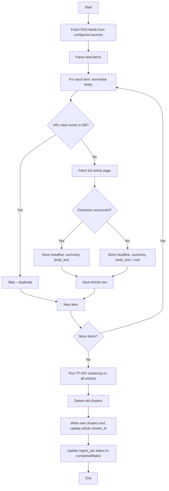

# Scraper Pipeline — News Pulse

This document describes the internal workflow of the Python scraper, from fetching RSS feeds to writing clusters back to the database. All processing happens in a single run‑and‑exit process, triggered either by the API (`POST /ingest/trigger`) or by a scheduled cron job.

---

## Workflow Overview

---

## RSS Normalisation

Different feeds use different field names and date formats. The scraper normalises each feed item into a consistent internal structure before further processing.

| Source field | Normalised field | Handling |
|--------------|------------------|----------|
| `title` / `title` | `headline` | Strip HTML, trim whitespace. |
| `description` / `content:encoded` / `summary` | `summary` | Use the longest available field; strip HTML. |
| `pubDate` / `published` / `dc:date` | `published_at` | Parse with `dateutil.parser`; fallback to current time if unparseable. Always convert to UTC. |
| `link` / `guid` | `url` | Extract the canonical URL; if multiple, prefer `link`. |
| Feed source (BBC, NPR, etc.) | `source_name` | Hard‑coded per feed, stored in config. |
| Feed URL | `source_url` | The RSS feed URL itself. |

**Deduplication:**  
We compute `url_hash = SHA‑256(url)` and check the `articles` table for an existing hash. If found, the article is skipped entirely – no updates are performed, even if the headline changed. This ensures idempotence across runs.

---

## Full Article Extraction

We use `trafilatura` to fetch and extract the main body text from the article’s web page.

- **Timeout:** 10 seconds per request (configurable via `ARTICLE_FETCH_TIMEOUT`).
- **Retry:** One retry on failure.
- **Fallback:** If extraction fails (network error, parse error, or no content), we set `body_text = null` and continue – the pipeline does not crash.
- **HTML sanitisation:** All extracted content is stripped of HTML tags before storage. We store only plain text.

**RSS Feed Fetch Timeout:** The `feedparser.parse()` function does not accept a `timeout` parameter in the version we use (6.0.10). To prevent indefinite hangs, we set a global socket timeout (`socket.setdefaulttimeout(30)`) before calling `parse()`. This is restored after each feed fetch.

---

## Clustering Cycle

After all articles are stored (new ones only), we run the TF‑IDF + cosine similarity pipeline on **all articles in the database** (including previously ingested ones). This ensures that new articles can form clusters with older articles, and that clusters remain coherent.

**Key points:**
- Old clusters are **deleted** (hard delete) and replaced by new ones.
- Articles are **not** deleted – they keep their `cluster_id` updated.
- This means cluster IDs change on every ingest. The timeline always shows the latest clusters.
- The `ingest_job_id` on each cluster links it to the run that produced it, providing traceability.

We do **not** merge incrementally – a full re‑clustering is simpler and more accurate for the data volume (hundreds of articles).

---

## Security Considerations

| Concern | Mitigation |
|---------|------------|
| **SSRF** | Not explicitly blocked in this version. The scraper fetches only configured RSS feed URLs and article links from those feeds. All URLs are validated to be `http` or `https` by `httpx`. |
| **HTML injection** | All extracted text is sanitised – HTML tags are removed before storage. |
| **Timeouts** | Each HTTP request (feed and article page) has a 10‑second timeout; if exceeded, the article is skipped. Feed fetching uses a 30‑second socket timeout. |
| **Resource exhaustion** | We limit the number of articles fetched per feed (50 per run) and cap the total articles processed in memory. |
| **Subprocess arguments** | The Python script receives no user input; all configuration comes from environment variables. |

---

## Failure Handling

- Feed parsing errors: log and continue with next feed.
- Single article fetch failure: skip that article, continue.
- Clustering failure: the entire job is marked `failed` and the error is captured in `ingest_jobs.error_message`. No partial clusters are written – we use a transaction that is rolled back on failure.